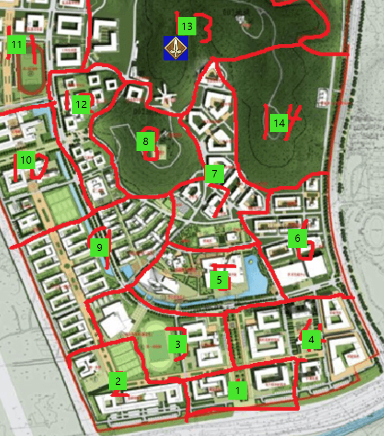
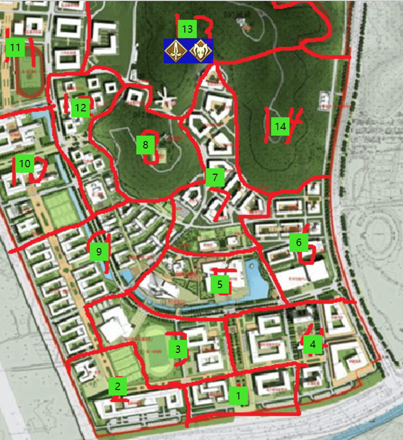

# 第二次圣杯战争
## 第一章	叛逆的剑士
Player-**离殇**视角

威大鸡 发表于 2017-08-15 02:00 GMT+8 

### 周日 中午12：00-下午3：00

【那么本次说明会到此结束，你们有三个问题可以提问】

随着监督者手上闪过一阵红光，**离殇**发现自己似乎可以发出声音了。还处于被突然邀请来参加这个所谓的圣杯战争的迷糊状态的**离殇**，率先举起了手。

【请把刚才最后所说的奖励和惩罚措施再说下！】

【参战中死亡的人不会真的死亡，卡片会代替你们承受致死的伤害，随后你们会昏迷到战争结束之后并且回到日常的生活之中；而胜利者将会获得一个完成愿望的机会，只要是在校方力所能及的范围之内，但是决出胜利者之后，仍然存活着的学生，不仅会被清除这部分记忆，而且学校会给予严重的退学处分】

**离殇**根据这个答案仔细思考了一下，看起来学校是鼓励我们交战到死，而且交战到死亡似乎也没有什么太大的影响，那么只要完成召唤之后等圣杯战争开始就直接去战斗就好了。

......

【好了，3个问题已经结束，请各位各自解散去进行召唤英灵吧】随后监督者消失在**离殇**和周围同学的视野之内。**离殇**看起来因为之前的思考似乎没有听清后两个问题的样子，随后**离殇**看着自己周围在互相警惕着的同学们，决定自己现行离开。【首先，先准备好物资做个据点才行。】**离殇**径直前往了教超。

【先买食物和水，然后建立据点的话..嗯..再来点绳索和铃铛来做据点的预警。其他的话，过会建立好据点之后再来买吧】，**离殇**认真的采购着必需品。

【嘿，**离殇**，听得到吗】

**离殇**瞥了一眼注意到教超的另一边站着另一位圣杯战争的参战者-**剑道**，**剑道**手上拿着两瓶矿泉水向**离殇**打招呼。

【一次只买两瓶水，这家伙看来准备的不够充分呢】**离殇**这么想到，于是决定无视那个名为**剑道**的男人，随后带着自己的大量物资前往前台结账。在付完钱之后，**离殇**背着他的物资向着教超外走去。中途还被一个不认识的人不小心撞到一下害的自己差点没有拿稳，克制住自己指责对方的冲动，向北方走去。而那个**离殇**不认识的男人，突然站在原地停下回头看着**离殇**离去的背影，男人口袋里的卡片一片漆黑。

**离殇**衡量了一下区域的安全性，随后选择背着这些物资一路走到13区山区的中间。

【将食物和水放在篝火旁边，随后用绳索将周围的圆形区域围起来，随后将铃铛挂在绳索之上，这样哪怕有没有凭依的人接近也可以提前进行报警了，紧接着按照从小到大，大概围出四个圈应该就非常安全了】**离殇**仔细的盘算着据点的布置。不过感觉按照普通人的身体似乎做这么多事情会比较花时间，于是**离殇**掏出了自己之前放在口袋中的卡片。

【宣告，汝身听吾号令，吾命与汝剑同在，应圣杯之召，显现吧！】

卡片瞬间发出闪亮的光芒，随着光芒散去，**离殇**手上的卡片浮现出了剑士Saber的图案。

【原来是莫德雷德啊，和我很合拍呢，可以好好的大干一场了】

随后**离殇**立刻进行了凭依，并且将自己的大剑和盔甲全都隐藏了起来，利用英灵状态下获得的力量，速度和耐力来完成据点的布置。

### 周日下午3：00-下午6：00

当**离殇**布置到第三个外圈的时候，**离殇**注意到一个树上贴着一张纸条，于是靠近了那个纸条，上面写着：

【我知道你在这里，我无意与你为敌，信的过的话，晚上六点十一食堂见面，我会坐在食堂南门口的位子见你，若是信不过，丢在这里就好了。不过我承诺，你若不先对我出手，我也不会与你为敌。——**拉文**】

**离殇**思考了一下利弊，决定先继续布置好据点。

【等完成据点之后，先休息一会然后5点50分再过去吧】**离殇**一边这么判断着同时没有停下自己辛劳的双手继续进行着据点的布置。

下午5点左右，一个非常安全的足以让人在里面居住7天的据点完成了，**离殇**擦干自己的汗水随后在据点中心篝火旁边喝了一瓶水，静静的坐着准备准时按时前往纸条中指明的地点。

### 周日下午6：00-晚上12：00

【你果然在这里】，**离殇**按时前往了纸条中所描述的位于11区的十一食堂，看见了南门口位置上的**拉文**。

【长话短说，我们结盟怎么样？这里可能会有别人的耳目，我们不如到我制作的据点继续商谈？】
**离殇**尝试邀请**拉文**与他一起行动。

**拉文**看着**离殇**的眼睛，随后思考了一会，点了点头，于是两人启程向13区山区的据点出发了。

【我的职阶是Berserker，英灵是吕布，你呢？】**拉文**在路上直接对**离殇**开口透露了自己的信息。

【Saber,莫德雷德，请多指教。】**离殇**也很爽快的直接告知了对方自己的真名。

随后，绕过**离殇**自己制作的警报装置之后，两人来到了据点内。

【看起来我们很合拍呢，而且看起来都很能打，这样，我们现在直接用令咒起誓结盟，然后我们一到晚上12点就开始狩猎那些落单的英灵怎么样？】**离殇**直接对**拉文**提出了自己的目的和想法。

【好的我接受，那么起誓的内容就交给你了，我**拉文**会跟你同时用令咒发誓的。】随后双方同时伸出自己带着3个令咒的右手。

【**离殇**，莫德雷德，在此使用令咒发誓，】

【**拉文**，吕布，在此使用令咒发誓，】

【从此之后我们将结成牢不可破的同盟，遵守以下事项：
- 第一，	永远不主动故意伤害对方
- 第二，	狩猎杀死其他英灵获得的令咒将按照**拉文**一画，我一画的顺序轮流获得
- 第三，	如果只有我们站在了最后的决战舞台，那么我会自杀让**拉文**获胜
- 第四，	我们之间会互相共享自己的英灵卡，让对方知道自己的所有能力
- 第五，	如果有人背叛了这个同盟，那么将受到再次失去一个令咒的惨痛代价！】

随后，两人手上的令咒均消失了一画，看起来双方的誓言已经生效了，随后**离殇**和**拉文**也互相交换了自己的英灵卡的资料。

【反骨之相吗，看起来到时候如果真打起来了我得离得和你远一点呢】**离殇**笑着调侃着**拉文**。

【我哪怕让我幸运瞬间翻倍我也会尽力不会伤害到你的，放心吧】**拉文**面色坚定的对着**离殇**说到。

【好了，我们也吃点东西休息吧，晚上12点开始，就是我们的表演时间了呢】，**拉文**点了点头，随后不久，**离殇**和**拉文**进入了梦乡。

周一凌晨0：00-上午6：00
 

伴随着漆黑的夜晚，**离殇**和**拉文**同时在12点睡醒了，两人确认了一下时间之后，互相确保了一下身上的武装和魔力，确定没有问题之后，两人启程开始出发去寻找落单的英灵进行狩猎。

两人先是下山来到了7区院系楼，没有感知到其他人的魔力，随后来到了6区十食堂和7区的交界处。

【你感知到了吗，食堂里面有两骑英灵的魔力，而且似乎也发现了我们，在向我们靠近】**离殇**警惕的对**拉文**说到。

【看起来其他人也很快就完成了同盟啊，不过我们可是狂战士和剑士啊，二对二的话我们可是丝毫不落下风呢】**拉文**鼓励着**离殇**。

【只不过一旦战斗开始之后我将会无法和你交谈，如果有什么战术规划的话先提前和我说好吧】，**拉文**提醒着**离殇**，**拉文**因为吕布的狂化等级比较高的原因，一旦进入了战斗，就无法与任何人进行沟通。

【你的宝具是军神五兵·弓，可以远距离对大范围区域进行贯穿打击，而我的宝具则也有着不亚于我那个混蛋老爹的圣剑的威力，到时候你站在原地这里，我去靠近他们，我等对方进入你的射程边缘的时候，就会直接使用魔力放出然后向对方两人解放宝具，你看到我宝具的光芒之后，随后遍直接向我们的方向进行轰击，这样就可以一次解决那两个人了，也不用怕轰到我，我的命可硬着呢】

【如果他们没死的话，我会向他们继续发动追击，你到时候也跟上我，而如果对方非常强大的话，你就直接跑吧，我应该也逃得出来，你放心！那么，他们也快要到我们这里了，那我先过去了，记住，不要因为我和他们在一起你就不敢放宝具，尽管一起打！】**离殇**随后离开了**拉文**向对方两个英灵靠近。

突然，**离殇**发现其中一个英灵垂直的飞上了天空，而因为天色过暗的原因，**离殇**并不能看清对方是谁，【切，算了，哪怕只有一个也要直接解决掉你！】**离殇**暗暗念到。同时，对方剩下的那名英灵距离自己似乎越来越近了。

【你好，请问你们是谁？我们这里有一些情报可以来互相交换一下，可以出来谈一下吗？】

**折原**的声音传进了**离殇**的耳内，**离殇**确保了对方已经进入了**拉文**的射程，解除了自己的头盔，将自己的魔力完全放出，随后快速疾奔向对方在地上的那名英灵。

【向华丽的吾父发起叛逆！】猩红的光芒从**离殇**手上的大剑发出，随后巨大的冲击轰向了完全猝不及防的**折原**，**折原**被吞没在这红黑色的光芒之中，被直接打飞到身后房子的墙壁上，受到了严重的创伤，而**离殇**没有追上，转身看着身后，果然，一个巨大的光炮直射向自己和躺在旁边墙壁上的**折原**，**离殇**快步地向侧方躲开了这个巨大的光炮并且看着光炮淹没了**折原**所在的位置。然而随后感知到了**折原**的魔力出现在了边上80的距离处。

【看来使用了令咒躲开了呢，不过转移这么短的距离可是你的重大失误呢，别想跑！】
**离殇**起身迅速向**折原**魔力所在的方向双手握着大剑飞奔。并且躲开了从天上射下来的一发箭矢。

**离殇**一路疾驰，已经看见了**折原**疲惫的身体躺在前方不远的地面上，双手全力握紧大剑，感觉自己只要靠近了他，就能随时一剑将他斩成两半。

突然，在经过前方一个路口的时候，**离殇**，亦或是来自莫德雷德的直感让**离殇**本能的减缓了脚步，随后一把长枪从路口的拐角处迅速的刺出，如果按照之前的速度前进的话那自己肯定已经被这个长枪刺穿了。

【怎么回事，完全没有感知到魔力，是暗杀者吗，不，这长枪肯定是枪兵，是谁？】**离殇**质问道，而对方似乎并没有想回应的意思。

【切，在后面吗？】不知为何，本来应该在自己前方拐角处偷袭自己的枪兵突然出现在自己的身后，枪刺入了**离殇**的盔甲，**离殇**忍住疼痛，【我啊，最讨厌你们这种偷袭的小人了】，反手挥舞着大剑将气息不明的枪兵一把扫开，枪兵被直接打飞到边上的墙上。

【你这混蛋，居然找了两个帮手吗，但是现在就是你的死期了！现在可没有人能帮你了！】**离殇**向前方的**折原**咒骂着，并且继续握紧大剑向**折原**冲去。

而**折原**望着向自己跑来的**离殇**，面容却丝毫没有慌乱，喊出【王之军势，AionionHetairoi！】。之后，**离殇**发现自己的面前突然来到了一片广袤的沙漠之中，而自己被无穷无尽的大军所包围着，而被重重大军包围着的**折原**，拿着红色长弓的枫酱，和拿着红色长枪的小古则站在距离自己很远的位置。

【这怎么可能，**拉文**也不在这里吗？】，发觉自己和队友的联系被切断的**离殇**，看着眼前的三个敌人和无尽的大军，【看起来只能逃跑了，这完全不是骑士的战斗】，随后**离殇**反身试图逃离这里，但是随后自己周围的士兵开始密集的向自己发动攻击，**离殇**虽然有厚重的盔甲，但是仍然被两个士兵砍伤了自己的手臂和大腿。

【不行了，完全逃不出去，只能这样了】，随后，**离殇**举起自己的右手，对着令咒命令自己转移回据点。随后令咒发出了红光，随后**离殇**降落到了自己熟悉的据点内的篝火旁。

【**折原**这家伙，短时间内就找到了两个盟友了吗，甚至还有一个可以遮蔽自己气息的枪兵，他们的行动真是太快了，失算了。】**离殇**隐藏了妨碍自己休息的盔甲和大剑，随后躺倒在了地上。【大帝伊斯坎达尔，红色长弓会飞到天空中的弓兵，还有一名会隐蔽气息的枪兵吗，希望**拉文**不会有事啊，那我就在这深度睡眠6小时补充一下状态好了。】随后**离殇**担心的望着还没有回来的**拉文**的方向，陷入了梦乡。

### 周一上午6：00-9：00
**离殇**睡眠中。

### 周一上午9：00-12：00
 

【你醒了啊，看起来受了不少伤了呢，睡的也很香呢】
**离殇**刚刚睡醒，就看见了守候在自己身边的**拉文**。

【昨晚你没事吧，你遇到了什么？】**离殇**赶紧询问着**拉文**昨晚他离开之后的情况。

【在我解放完宝具之后不久，你和那几个英灵的魔力气息全都突然消失了，我也不知道你们发生了什么，随后不久之后，我感知到了2个英灵的魔力又凭空出现在了一起，随后他们一起向4区计科楼的方向过去了，我之后也追到了4区的边上，感知到他们似乎位于地科楼的位置原地不动，我感觉似乎是敌人的气息之后就回来了我们的据点，然后看到你正在进行休息，就帮你警戒了一下周围】**拉文**回复道。

【他们有3个人，**折原**是伊斯坎达尔，枫酱是红色长弓会飞在天上的弓兵，而小古是会气息遮蔽的枪兵，他们发动了王之军势将我带了进来，我使用令咒逃了出来，不过**折原**似乎已经身受重伤的样子，我们之后赶紧去趁他们不备解决掉他们吧】**离殇**将自己的所见也描述给了**拉文**。

【你似乎已经受了伤了，尽管如此也要去向他们3个发起挑战吗，不如我们先去再寻找一些盟友再和他们进行决战？】**拉文**担心地回答道。
**离殇**也思考了一下，决定休息一会之后中午和**拉文**先前往6区战斗过的地方查询情况，随后在寻找其他的落单的英灵尝试结盟然后晚上再商议是否去挑战**折原**三人。

### 周一中午12：00-下午3：00
 

**离殇**和**拉文**两个人来到了6区昨天战斗过的地方，因为战斗造成的墙壁的破损似乎已经被校方暗中所修复好了，然而并没有感知到其他魔力，似乎对方没有返回这里进行侦察。

【他们的基地是在4区地科楼是吗？这么近也不过来看看似乎他们也在盘算着什么。】**离殇**思考着说道。

【是的，不过看起来这里没有什么有用的信息也没有什么其他英灵存在，你还要在这里搜索一会吗？】**拉文**问向**离殇**。

【不排除对方有解除凭依来看现场的可能性，我继续在这里搜索和观察一会吧，这样如果他们有人不凭依就过来的话我就可以直接解决他们！】

【那我先回去9区教超买一点食物好了，我们据点的食物份额只够一个人生活7天，如果我们两个人之后要一起生活7天的话据点的食物是不够的，我去买完就回来，你搜索完就在这里原地等我吧】，**拉文**说完这些随后向9区的教超前进。

看着**拉文**远去的**离殇**，也开始了自己的搜查和等待。
随着时间的推移，**离殇**发现**折原**3人似乎并没有再次前往这里的迹象，但是由于**拉文**还未回来，**离殇**决定继续原地等待着。

【怎么过了这么久还没有回来，这家伙。。该不会背叛我了吧。。】
等待中的**离殇**愈发焦躁了起来。

### 周一下午3：00-晚上6：00
 

【**拉文**这家伙。。该不会是觉得对方的实力。。比我强大。。就去投靠对方了吧。。】

等到3点的**离殇**绝望的面对着**拉文**至今没有回来的现实。

【不。。说不定他提前把食物带到据点里了，东西太多了带不过来也有可能呢】

**离殇**启程前往了自己在13区的据点。

然而到了据点之后，在他面前的还是空荡荡的，摆着只够一个人生活7天的食物的营地。
【看来，我被背叛了啊，叛逆的骑士原来也有会被背叛的一天啊】
渐渐的失去了理智的**离殇**，来到了8区后山，并且躺在山顶的草地上，解除了凭依，看着阴暗的天空。
【已经，没有退路了，在这里休息到晚上，然后哪怕只有我一个人，我也要杀到他们基地，并且一定要杀死那个大帝，还有那个背叛了我的人】被愤怒冲昏了理智的**离殇**渐渐进入了梦乡。

### 周一晚上6：00
 

**离殇**慢慢醒来，然而这次身边却没有人守候着他，**离殇**确认了一下时间。

【是时候了，**折原**和**拉文**，我要让你们付出代价】

**离殇**走下了后山，准备先不凭依，等用普通人的姿态搜查到对方基地的时候，立刻进入凭依然后用令咒解除宝具的冷却再用令咒进行强化随后带走里面的所有人，来完成自己的复仇。

**离殇**带着愤怒下了山来到了9区宿舍楼，随后顺着大路进入了5区，走过了大活门口，来到了图书馆面前的广阔空地上，站在灯火旁边。
【前面就快要是4区了，给我做好准备吧，**折原**和**拉文**！】

**离殇**刚刚迈出第一步，眼前本来还是校园夜景，突然再次变成了一片广阔的沙漠。
【什么，这怎么可能？】
**离殇**回头看到露出了戏谑笑容的**折原**，试图迅速用右手从口袋中拿出卡片进行凭依，但是很快他身边的士兵将自己的右手直接砍下。握着卡片的右手直接摔落到了沙子上，随后被大军所踩碎。

无尽的长矛刺穿了**离殇**的身体，**离殇**躺在地上奄奄一息已经快要什么都看不到了，这时身边的大军渐渐散开，**折原**拿着自己的剑走到**离殇**的身上。
【永别了，叛逆的剑士哟】
不想看到**折原**胜利的笑容的**离殇**闭上了自己的双眼，在剑刺入自己的心脏之前，他的眼前是自己和**拉文**互相拿着卡片发誓永远不会背叛对方的画面。
【**离殇**，莫德雷德，在此使用令咒发誓，】
【**拉文**，吕布，在此使用令咒发誓，】

随后**离殇**的意识陷入了永恒的黑暗之中。

***
| 职介 | 真名 | 性别 | 武装 | HP | MP |
| --- | --- | --- | --- |--- | --- | 
| Saber | 莫德雷德 | 女 | 克拉伦特(剑) Clarent | 11 | 200| 

| 筋力 | 耐久 | 敏捷 | 魔力 | 幸运 | 宝具 | 
| --- | --- | --- | --- |--- | --- | 
| B+ | A | B | B | D | A |

| 职介技能 | 描述 | 
| --- | --- | 
| 对魔力 B | 低于对魔力等级的技能和魔力攻击直接无视， 对于B等级的敌方技能判定造成一个惩罚骰 | 
| 骑乘 B | 所有普通载具都能使用，使用载具时移动效果翻倍 | 
***

| 保有技能 | 描述 | 冷却 | 魔力消耗 | 
| --- | --- | --- | --- |
| 直感 B | 在战斗中可以感受到最适合自己行动的能力。 被动：遭遇偷袭时过一次幸运，如成功则可以躲过这次袭击。  主动：过一次幸运判定，如果成功，下一次被攻击的被动回合回避、 防御、反击的成功等级+1（此技能不占用回合数）。| 4T | 20MP |
| 魔力放出 A | 通过让武器甚至自己的身体携带上魔力并瞬间释放而出的能力。  主动：此次战斗中下一次攻击造成的伤害+2。| 3h | 50MP |
| 战斗续行 B | 在被圣枪贯穿之后仍挥动着手里的剑给了亚瑟王致命的重创。  被动：如果HP降至0以下（但若HP低于或等于-3时，不会触发），则HP恢复为2。| 48h | - | 
| 领导力 C- | 指挥军团的天性才能。在团体战斗中让己方的能力提升， 而莫德雷德的领导力在反抗体制的时候才会发挥出其真正价值。  主动：下一次的攻击提供一个奖励骰，可以给同时给自己和多个目标提供。  如果领导的是叛军，则冷却时间变为2小时。| 3h | 20MP |
***

| 宝具 | 等级 | 种类 | 距离 | 最大捕捉 | 魔力消耗 | 冷却 | 
| --- | --- | --- | --- | --- | --- | --- |
| 隐藏不贞的头盔 Secret of Pedigree | C | 对人（自身）宝具 | 0 | 1人 | 被动 | - |

| 宝具介绍 |
| --- |
| “绝对、绝对不可以摘掉的头盔”。从母亲那里得到了这样的话语。 当受到2点及以上的伤害时可以减免1点的伤害，免疫毒伤害，同时可以隐藏自己除了能力值、职介技能以外的真名、宝具、固有技能等信息。|
***
| 宝具 | 等级 | 种类 | 距离 | 最大捕捉 | 魔力消耗 | 冷却 | 
| --- | --- | --- | --- | --- | --- | --- |
| 灿然辉耀的王之剑  Clarent | C | 对人宝具 | 1 | 1人 | 被动 | - |

| 宝具介绍 |
| --- |
| 曾经保管在亚瑟王的武器库当中，表示著王位继承的剑，被莫德雷德强抢来使用时等级有所下降。 使用克拉伦特时，筋力、敏捷和魔力的参数值上升半个等级。*|

*调整：原设为上升一个等级，为游戏平衡性而作此调整。

***
| 宝具 | 等级 | 种类 | 距离 | 最大捕捉 | 魔力消耗 | 冷却 | 
| --- | --- | --- | --- | --- | --- | --- |
| 向端丽的吾父发起叛逆  Clarent Blood Arthur| A+ | 对军宝具 | 50 | 3人 | 80MP | 24h |

| 宝具介绍 |
| --- |
| 由于莫德雷德曾经夺取了亚瑟王保管着的王者证明“灿然辉耀的王剑(Clarent)”并以此让亚瑟王遭受了致命伤，所以在莫德雷德拿起它的时候会变化成憎恶的邪剑。本来是放出白银光辉的华美的剑，不过伴随着发动而上红黑色的血，形状也丑陋地扭曲起来。让汹涌的憎恶缠于剑身并放射出去的，灾厄之魔剑。解除“隐藏不贞的头盔”，对命中的敌方造成3点伤害，如果对方是亚瑟王及其变种，则伤害翻倍。（使用后直到这次小战斗结束都无法装备“隐藏不贞的头盔”）。|

