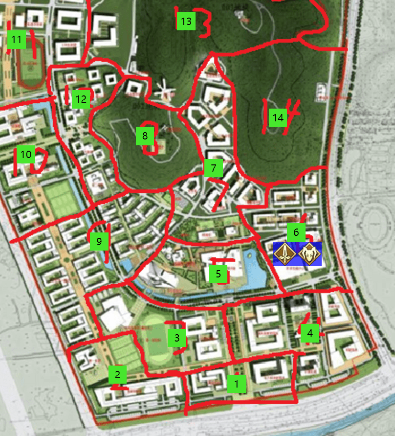
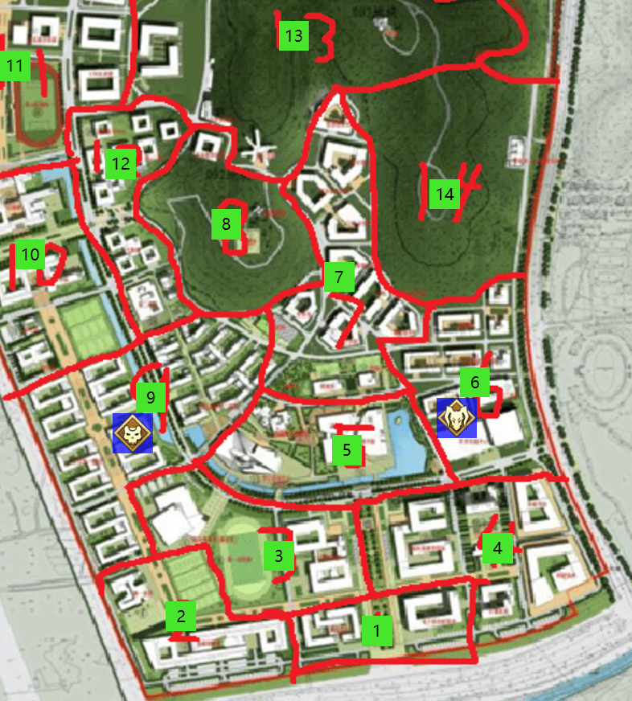
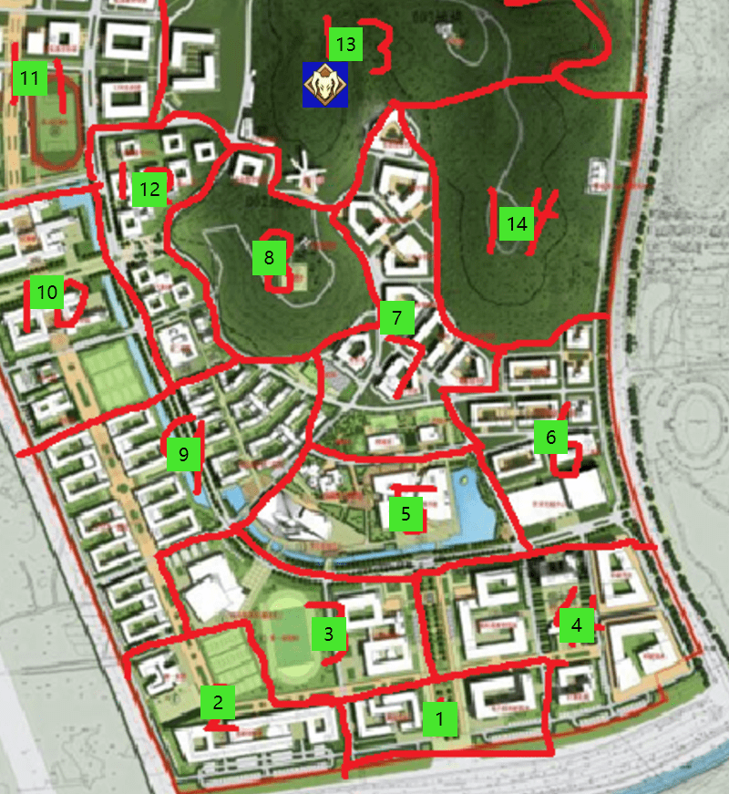
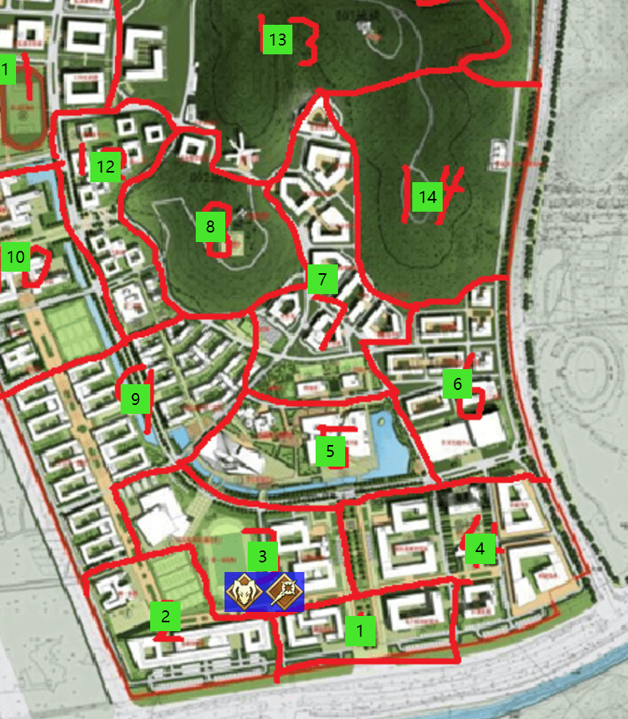
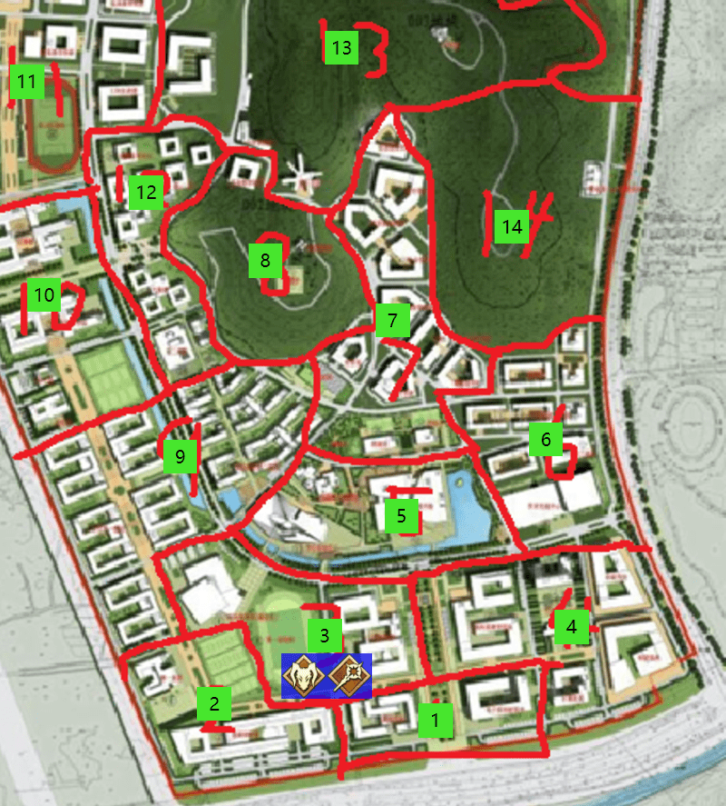

# 第二次圣杯战争
## 第二章 孤独的战士
Player-**拉文**视角

威大鸡 发表于 2017-08-15 22:00 GMT+8 

### 周一 中午12：00-下午3：00


 
**离殇**和**拉文**两个人来到了6区昨天战斗过的地方，因为战斗造成的墙壁的破损似乎已经被校方暗中所修复好了，然而并没有感知到其他魔力，似乎对方没有返回这里进行侦察。

【他们的基地是在4区地科楼是吗？这么近也不过来看看似乎他们也在盘算着什么。】**离殇**思考着说道。

【是的，不过看起来这里没有什么有用的信息也没有什么其他英灵存在，你还要在这里搜索一会吗？】**拉文**问向**离殇**。

【不排除对方有解除凭依来看现场的可能性，我继续在这里搜索和观察一会吧，这样如果他们有人不凭依就过来的话我就可以直接解决他们！】

【那我先回去9区教超买一点食物好了，我们据点的食物份额只够一个人生活7天，如果我们两个人之后要一起生活7天的话据点的食物是不够的，我去买完就回来，你搜索完就在这里原地等我吧】，**拉文**说完这些随后向9区的教超前进。

**拉文**从6区十食堂经过5区图书馆之后进入了9区宿舍楼。

【得赶快买完食物之后和**离殇**汇合呢】，于是**拉文**加快了自己的脚步。

**拉文**刚刚来到教超门口，便立刻注意到了一个熟悉的身影---**剑道**正靠在3栋门口的柱子上似乎在打盹，并且身边似乎有一个巨大的背包，里面似乎塞满了东西。而自己因为没有凭依的关系，对方似乎没有发现自己。

【那个，请问**剑道**你在做什么？】**拉文**战战兢兢的问道，因为不确认对方是否处于凭依也不确认对方的是否对自己有敌意，**拉文**和**剑道**保持了一定的距离。

【ho？我一直保持着浅度睡眠居然没有感知到你的接近，看起来是个有本事的人呢】被喊醒的**剑道**露出了警惕的神色。

【emmmmm,我没有进行凭依，所以你感知不到我魔力是正常的吧，那么你在白天这么睡在这里是什么情况？】**拉文**也没敢接近**剑道**。

**剑道**上下打量了一下**拉文**，随后说道【先问你一下，刚才在楼上的那位该不会是你吧？】

**拉文**不明白**剑道**在说什么，露出了疑惑的表情。

【看来你不是，我刚才和**鱼鱼台**约在这里会面，结果三栋的楼顶上出现了一个自称是ruler的奇怪的人，他当场就逃走了，我就在这里蹲守那个人，但是没有蹲到，所以怀疑了你】**剑道**解释道。

【原来是这样，我这里的话，和**离殇**结盟了，但是另一边**折原**小古和**枫酱**似乎三人结成了同盟，他们合起来的力量过于强大，我们需要一起对抗他们，你能加入我们吗】**拉文**向**剑道**提出结盟邀请。

【不好意思，我暂时不打算和任何人结盟，不过必要的帮助我会提供给你，顺便，在下是暗杀者，真名我就不透露了】**剑道**一边说着一边从旁边的大背包里拿出三个瓶子，内部装有淡黄色的液体。【这三瓶是威力巨大的毒药，我可以直接送给你当作友好的证明，相对的，如果你有什么信息的话也提供给我可以吗，我的活动区域基本就在9和12区这两个地方】

**拉文**思考了一下，随后上前从**剑道**手中接过这三个瓶子。【好的，我和**离殇**的据点在13区中间，你要是有什么情报的话，可以在13区左侧的房子那里贴一张纸条，我到时候会去确认的，而我这的话，会在这附近的布告板里贴海报来告知你什么时候会面，怎么样？】

**剑道**同意了**拉文**的要求，随后**拉文**发觉自己在这里逗留的有些久，确认了一下时间

【哎呀不好马上就要3点了，**离殇**还在等我，那我先走了！】

随后望着**拉文**离去的背影，**剑道**继续陷入了睡眠。


### 周一 下午3：00-下午6：00


 
**拉文**3点匆匆忙忙的买完食物赶回了6区，然而却没有看到**离殇**的身影。

【他是一直在搜索还没找完吗？那我在这吃点东西等下他吧】

随后**拉文**进入了十食堂，点了一份拉面，吃到了下午4点并且观察着外面的动向，然而，直到**拉文**吃完为止，都没有发现**离殇**的影子。

【他会不会是已经回据点了？】抱着这个想法的**拉文**随后也赶往了13区自己的据点处。

然而在回到篝火处的时候，**拉文**依然也没有看到**离殇**的身影，**拉文**把新买的食物放在了据点里，并且将据点打扫整理了一下。

【先就在据点里休息吧，等到晚上**离殇**一定会回来的。】
随后**拉文**便陷入了梦乡。

### 周一下午6：00-下午12：00


 
保持凭依浅度睡眠状态的**拉文**，保证了自己只要**离殇**一回来就能感知到他的状态。

尽管是浅度睡眠，**拉文**也做了一个梦。

在梦里，**离殇**咒骂着他【叛徒，你这个叛徒！】，**离殇**愤怒的握起了自己的大剑，刺穿了自己的身体。

随后**拉文**惊醒了，然而**离殇**并不在自己身边，自己也感知不到任何魔力。

**拉文**确认了一下现在的时间，晚上的11点。

【还没有回来吗。睡到明天早上6点的话，他一定会回来的，不然他疲劳的身体肯定会吃不消的。】**拉文**再次睡了过去。

### 周二凌晨0：00-上午6：00


 
**拉文**在睡眠中多次醒来，但是并不是因为有魔力波动而惊醒，而是为了确认自己身边的人是否回来了。然而尽管睁开双眼再闭上双眼多少次，**离殇**都没有出现在**拉文**的视线之内。


### 周二上午6：00-上午9：00


 
**拉文**最后一次从睡眠中醒来，已经是上午6点了，然而**离殇**却再也没有回到这个据点里。

虽然**拉文**很担心**离殇**，但是自己也不能因此而停滞不前。

【一直没等到我就先走了，今晚零点我会返回据点，今天主要在学校左侧活动】

**拉文**写下了一张纸条，留在了据点里，随后动身前往了13区左侧的楼房处去确认**剑道**是否留下信息。

```
onts: 毒药你们可以直接撒人脸上，也可以看能不能涂上去之类的，然后貌似有被抵抗的可能，如果没有被抵抗的话，那么会直接立刻掉血。
PS：我会在早上9~12的时候去看10区域的公布栏，会客时间则是12~3
PPS：这个**鱼鱼台**貌似会用机械鸟，如果你知道他是谁的话务必告诉我，我会拿东西或者情报交换
```
**拉文**仔细的阅读了这张纸条，却发现有一点褶皱的痕迹，是被其他人触碰过了吗？不过既然是白天哪怕被看到应该也不会有太大影响吧。于是**拉文**直接进入了10区布告栏边。

【下午一点校医院背后见面，来自一个你赠送过礼物的人】

**拉文**在10区的布告栏张贴了自己的海报，

随后**拉文**决定向9区前进，看看能不能在9区老地方看到**剑道**，如果能直接见到的话，那么就最好了。

然而当**拉文**刚刚进入9区宿舍楼的时候，**拉文**就感知到一个魔力正在快速向自己前进，随后**拉文**迅速撤回了10区并且向后跑了一小段距离，观察对方是否会继续接近自己。

果不其然，这个魔力在不久之后进入了10区，**拉文**随后迅速的躲藏到了校医院的背后，而那个魔力似乎停留在原地没有向自己移动的迹象。

【是敌人吗？还是说是**剑道**？】**拉文**心中盘算着对方的可能性并且准备着不同情况的应对策略。

【喂，请问你是谁？可以报上你们名字吗？】

突然一个没听过的声音出现在了自己的头上，**拉文**警惕的抬起了头，却发现了一个机械制的小鸟飞到了自己的头顶。

【是使魔吗？都看到我了为什么还要问我是谁？】**拉文**陷入了思考，并且思考要不要回答他。【等一下，难道这个鸟是没有视野只能感知魔力的存在？那么先试探一下吧】

【首先请告诉我你是谁？】**拉文**对着机械鸟喊道。

【我是**鱼鱼台**，我没有恶意，我只是想获得更多的一些情报】**拉文**注意到机械鸟上似乎放置着一个对讲机，不过也因为对方并不是**折原**三人组而松了一口气。

【我是**拉文**，你是来结盟还是单纯来进行信息的交换的？如果有结盟意向的话我倒是有不少信息可以和你沟通一下】**拉文**对着机械鸟交涉到，机械鸟在原地飞了一小阵子之后，传出了声音【我可以和你合作，那么你先出来吧，这样方便交流】，**鱼鱼台**做出担保。

**拉文**随后舒了一口气，考虑到附近人很多，对方如果想攻击自己也得不偿失，于是走了出来来到了**鱼鱼台**面前。

【我是**拉文**，我之前和**离殇**结盟了，并且在第一天晚上和**折原**小古**枫酱**的三人组遭遇并且作战了，对方的实力非常强劲并且似乎已经形成了牢固的同盟，我们剩下的人如果不结盟的话无法与他们进行对抗，我之前也遇到了**剑道**，不过他似乎表示保持中立只给予物资的帮助。怎么样，**鱼鱼台**可以帮助我们吗？】**拉文**见面就将自己的信息交流了出去。

【原来是这样啊，我说怎么每次让机械鸟去侦察4区总有好几个魔力在一起，那么他们3个结盟的话，还剩下4个人，**剑道**中立的话那我也只能加入你们了呢，那么你们的职阶是？哦顺带一提我是caster魔术师】**鱼鱼台**衡量了一下之后决定向**拉文**示好。

【我是berserker狂战士，而**离殇**则是saber剑士，我们可以组成你手下的利刃来保护你。】**拉文**也向**鱼鱼台**表明了自己的职阶。

【很抱歉打扰你们的交谈，据我所知，昨天已经有一名参战者退场了，如果按照你们所说的已经有3人结盟的话，那么剩下的人就只剩下你们两个和那位**剑道**或者**离殇**了】
这时之前在看宣传栏的一名从来没见过的人向**拉文**和**鱼鱼台**搭话。

【不好意思忘记先说自己身份了，我是ruler贞德，暂时负责来确保这次圣杯战争的顺利进行和保护普通学生不受战争波及的。以及这次战争可能出了些什么问题，不然我想我也不至于会被召唤出来。】

相比于贞德的突然出现，**拉文**更惊讶的在于【一名参战者退场了】，**剑道**之前在13区左侧楼房放了纸条，**鱼鱼台**还在自己的面前，另外3人联盟也不至于内讧致死。那么这名退场的人该不会是。

**拉文**一瞬间感到眼前一片漆黑，所幸自己还是撑住了这次打击。

【那么我们按照**离殇**已经退场的可能性来判断的话，要对抗对方的3人组，我们就有必要联合**剑道**了，或者说，贞德小姐可以帮助我们吗？】**拉文**忍住痛苦，对这个自己从没见过的人提出拉拢意见。

【不，我不会参与你们的战斗也不会协助你们任何一方，我会继续对这次圣杯战争的异常进行调查，同时我也只会保护受到战争波及的普通学生，所以容我谢绝你们的好意】贞德小姐摇了摇头。

**鱼鱼台**观察着眼前的贞德，思考了一阵，随后开口【既然如此的话，贞德小姐是否可以现在展开一次宝具呢，反正贞德小姐的宝具只会保护里面的人，也不会波及到其他群众对吧】**鱼鱼台**有深意的对贞德说道。

【现在周围的学生太多，擅自解放宝具的话会让普通人得知圣杯战争的存在，所以请容我拒绝，校方想必也不会允许我这么做，那么接下来我也要去通知下其他英灵了，请记住，这次的圣杯战争有什么地方不对劲，你们必须联合起来！】说完这些之后，贞德走出了**拉文**和**鱼鱼台**的视线，在交谈中他们全程没有感知到贞德身上散发出的魔力。

【看来这里交流圣杯战争的内容也不太合适呢，既然我们合作了，我就明说了，我作为caster我的据点布置在了3区体育馆，之后的内容不妨来体育馆继续商谈吧】

**拉文**点了点头，随后两人来到了体育馆，果不其然在进入3区的时候**拉文**感知到了一阵酥麻，似乎确实有结界存在的样子。

考虑到下午要和**剑道**在校医院后面见面，**拉文**和**鱼鱼台**决定在体育馆先休息到12点。

### 周二 上午9：00-中午12：00


 
**拉文**和**鱼鱼台**在体育馆内保持着休息，为下午拉拢**剑道**做好准备。

### 周二 中午12：00-下午3：00


 
【好，我要出发去校医院和**剑道**会面了】**拉文**整理好自己的衣服对**鱼鱼台**说道

【我和你一起去吧，既然是合作拉拢对方入伙，多一个人也好说话】**拉文**随后表示同意，两个人一起从体育馆出发向10区移动。

然而，当**拉文**和**鱼鱼台**刚踏入9区宿舍楼时，突然感知到有两个魔力位于五栋附近，**拉文**敏锐的感知到应该是那个三人联盟：大帝**折原**，弓兵**枫酱**和会隐藏气息的枪兵小古。随后立刻带着**鱼鱼台**反身离开回到了体育馆内。

【他们似乎在拦截着我们，**剑道**也会因此有危险，我们现在怎么办？】**拉文**陷入了思考。

【没事，我还有机械鸟，而且不会被轻易察觉，这样就可以一边绕过他们3人，一边到12区**剑道**的宿舍区找他，哦忘记说了，在和你接触之前我就找到过**剑道**的宿舍，不过他也表示只和我建立情报交换的关系，当然现在情况不一样了，一定要拉他入伙。】**鱼鱼台**随后掏出机械鸟，并且直接将其放飞，机械鸟径直地飞向**剑道**的宿舍。

【是**剑道**吗，现在情况似乎不太对劲，**离殇**已经退场了，而另外的3人已经结成了同盟，并且埋伏在了9区可能要对我们进行攻击。我这里我和**拉文**现在已经合作，如果可以的话你能来一趟体育馆吗？记得不要走9区走！】
**拉文**看着**鱼鱼台**对着对讲机说话，想了想机械鸟应该也是因此可以发出声音的吧。

在一阵交谈过后，**鱼鱼台**表示**剑道**答应过来看看情况，不过**剑道**似乎执意要经过9区也看看情况，**拉文**很担心**剑道**的安全，不过也只能坐在原地静静地等待。


时间大约4：30左右，**剑道**突然凭空出现在体育馆内，身上有几处砍伤的痕迹，**拉文**注意到他手上的令咒也少了一画。

【可恶那帮家伙，完全不讲道理！我就想跟他们聊下天问下情况，他们直接就在白天攻击我甚至对我发动了王之军势宝具！】

**拉文**看出**剑道**非常愤怒的表情，看起来是试图接近他们3个然后直接遭受攻击，最后使用令咒转移逃到了这里的样子。

【不过有个值得注意的是，他们3个人手上的令咒都是满的，不过既然他们这么对我，那我就只能和你们直接合作了，还说想当一个保持中立的毒药商人呢】

在听着**剑道**的信息和入伙宣言的时候，**拉文**突然发现有些地方不对劲。

【我记得很清楚，**折原**用令咒躲开了我的宝具，他现在手上的令咒真的是满的吗，你确定没看错吗？】**拉文**向**剑道**提问。

【确定是满的，我绝对没有看错】**剑道**自信满满的回复道。

【这帮家伙，看起来通过什么方式获得了令咒？难道是，从死去的**离殇**手上获得了这个令咒 】**拉文**思索着。

【那我们这次算是正式结盟了吧，那么先把各位的职阶说一下吧】

【**剑道**，职阶是暗杀者，擅长制毒，请多指教】

【**鱼鱼台**，职阶是魔术师，擅长..各种发明吧，总之也请多指教】

【**拉文**，职阶是狂战士，带上我的挚友剑士的份，请大家多多指教】

***

【**折原**，我会让你付出代价的】**拉文**暗中念道。

 ***
| 职介 | 真名 | 性别 | 武装 | HP | MP |
| --- | --- | --- | --- |--- | --- | 
| Berserker | 吕布 | 男 | 军神五兵·方天画戟 | 11 | 200| 

| 筋力 | 耐久 | 敏捷 | 魔力 | 幸运 | 宝具 | 
| --- | --- | --- | --- |--- | --- | 
| A+ | A+ | B+ | C+ | C+ | A |

| 职介技能 | 描述 | 
| --- | --- | 
| 狂化 A | 冷却时间6小时，成功造成1点伤害后<br />可以追加1点伤害。战斗中视为不可沟通状态。| 
***

| 保有技能 | 描述 | 冷却 | 魔力消耗 | 
| --- | --- | --- | --- |
| 勇猛 B | 接下来的三次攻击，如果命中则可以额外造成1点伤害。<br />B等级及以下的精神类技能对吕布无效。 B等级的则需要过一次幸运判定。| 6h | 20MP |
| 反骨之相 B | 在战斗中，如果吕布可以攻击的目标不止一个，<br />则每次攻击前进行一次幸运检定，未通过则会随机攻击一个错误目标。优先友方。 | - | - |
| 乱世的枭雄 A |下一轮，吕布造成的所有伤害+1<br />每有一个吕布可以攻击的对象则攻击行动获得一个奖励骰。 | 12h | 30MP |
***

| 宝具 | 等级 | 种类 | 距离 | 最大捕捉 | 魔力消耗 | 冷却 | 
| --- | --- | --- | --- | --- | --- | --- |
| 军神五兵·弓  God Force | A | 对城宝具 | 120 | 5人 | 40MP | 24h |

| 宝具介绍 |
| --- |
| 作为吕布奉先的主武器而广为人知的双手武器方天画戟的真名。<br />将军神五兵变形为弓模式，对瞄准路径上的所有目标造成无法防御、可以闪避的3点伤害。|
***


