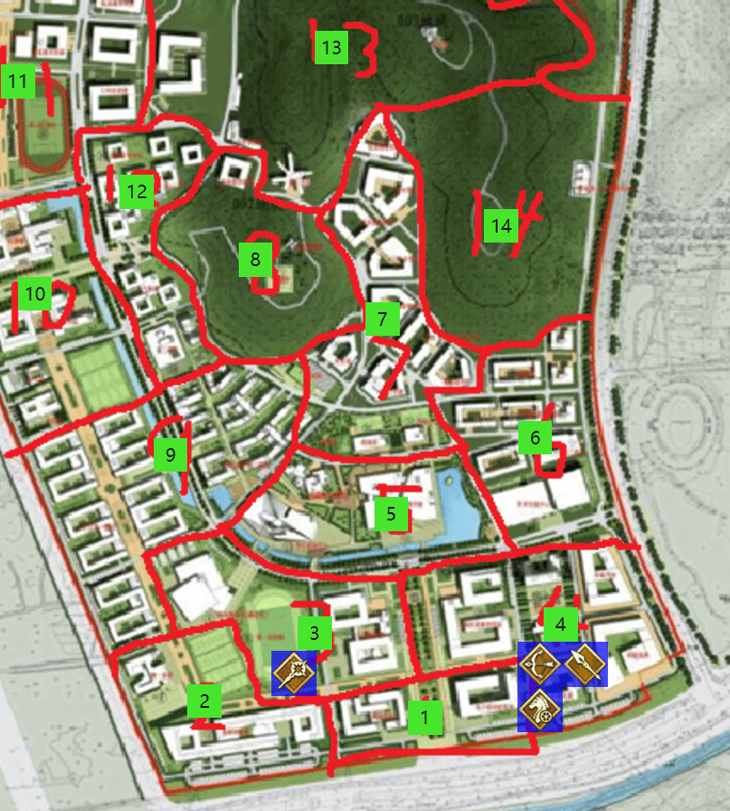
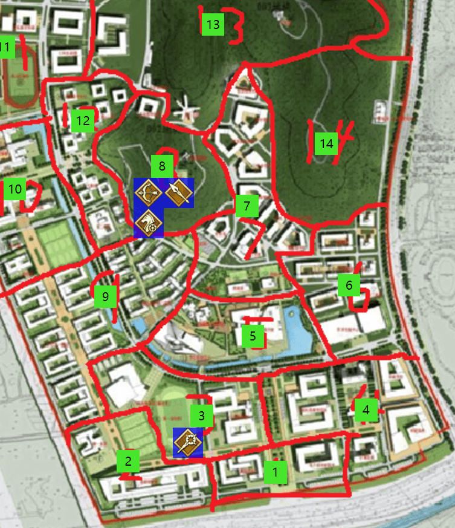
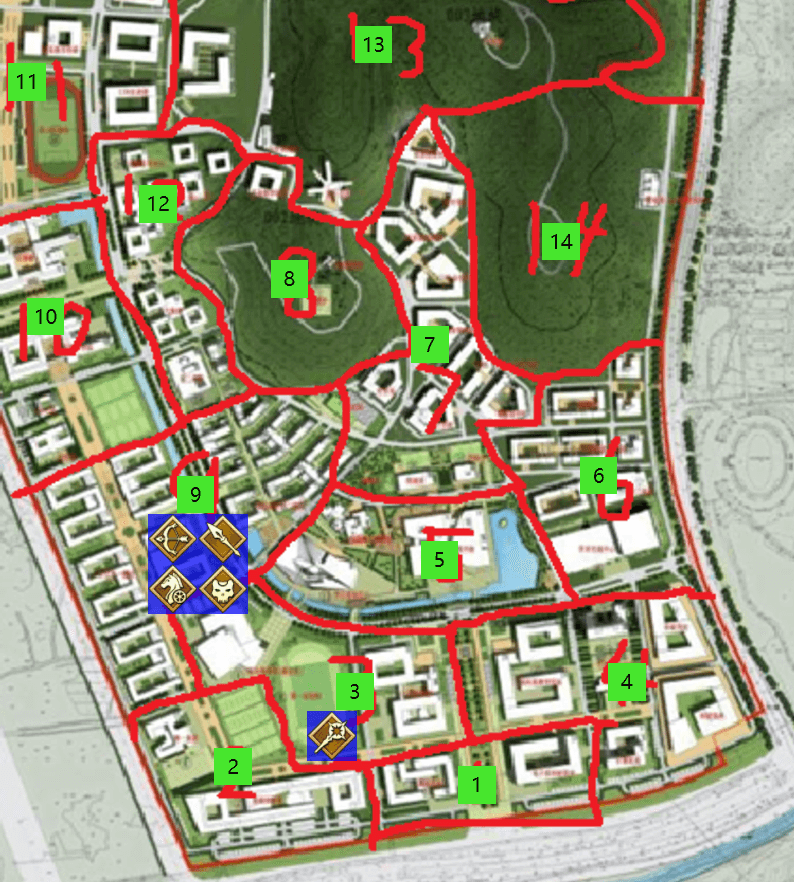
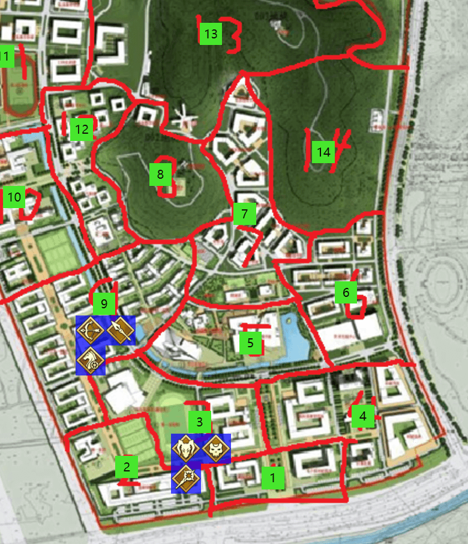
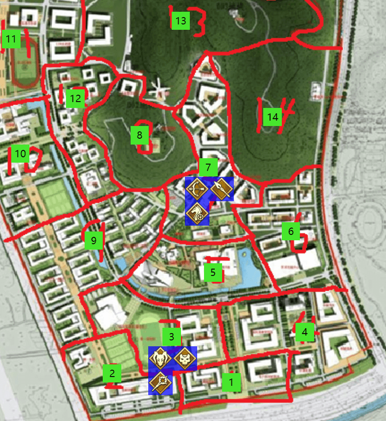
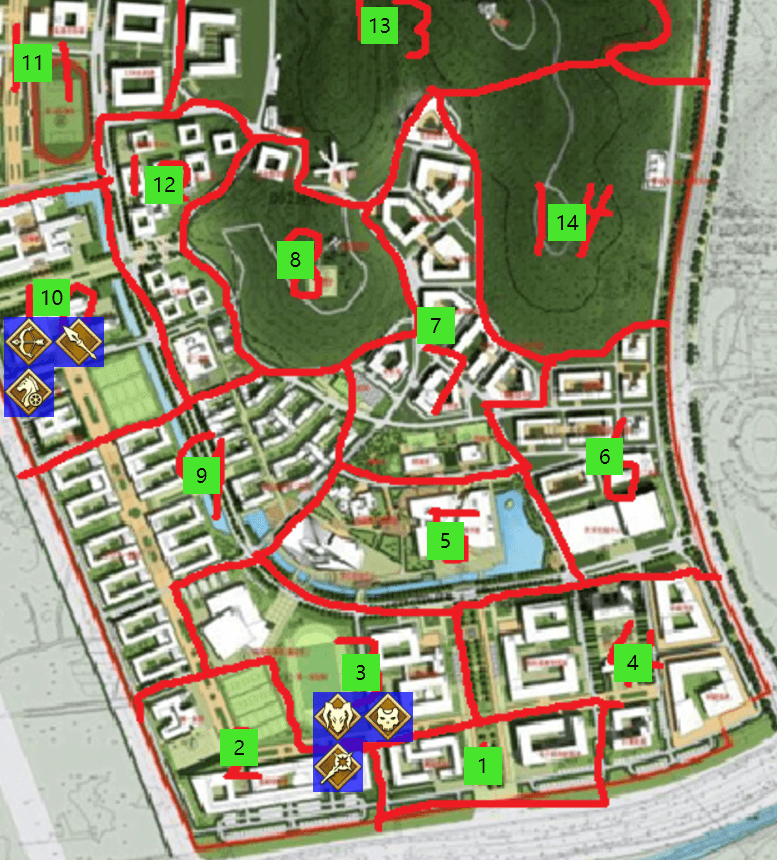

# 第二次圣杯战争
## 第三章 秩序的建立
Player-**折原**视角

威大鸡 发表于 2017-08-17 04:07 GMT+8

###周一 下午6：00-晚上12：00

【什么，这怎么可能？】

**离殇**回头看到露出了戏谑笑容的**折原**，试图迅速用右手从口袋中拿出卡片进行凭依，但是很快他身边的士兵将自己的右手直接砍下。握着卡片的右手直接摔落到了沙子上，随后被大军所踩碎。

无尽的长矛刺穿了**离殇**的身体，**离殇**躺在地上奄奄一息已经快要什么都看不到了，这时身边的大军渐渐散开，**折原**拿着自己的剑走到**离殇**的身上。

【永别了，叛逆的剑士哟】

**折原**将自己的剑刺入了**离殇**的心脏。

【没有想到这家伙连凭依都没有，就一个人这么过来了。好了，接下来回去跟他们汇报一下好了】

返回到现实世界中的**折原**，骑着自己的飞马停留在图书馆前的空中。

【本来只指望在5区图书馆的上空做下警戒的，还真的抓到一个试图袭击的人】**折原**一边飞回位于4区地科楼地下的据点，一边回忆着，【不过仔细一看的话，手上的令咒似乎也回到了三画，看起来存在着击杀奖励令咒的规则，这个也跟他们说一下好了】

随后不久，**折原**赶到了位于4区地科楼地下的据点，而此时里面的**小古**和**枫酱**还在休息中，随后**折原**喊醒了他们，并且将刚才发生的事情告诉了他们。

【既然**离殇**在死之前是向我们这里移动，说不定我们的据点也已经暴露了，毕竟在昨天晚上还有一名不知名英灵在协助**离殇**】**枫酱**在分析了**折原**的报告之后，分析得出了结论。

【确实如此，我们也无法确保那位英灵是否会向剩余的两位英灵透露我们的据点，如果他们隐藏了气息到我们附近，并且再次使出群体宝具，我们就会很危险。所以我建议我们需要转移阵地。】**小古**向另外两人提出了转移阵地的建议。

【好的，我研究了一下地图，我认为作为牢固的3人联盟，8区后山会是个不错的地点，地形易守难攻，而且位于中心也适合向周围进行侦察，而且考虑到除了我们之外剩下的人只有3人，我们应该可以考虑见到落单的英灵就可以对他发起攻击，这样可以在他们结盟之前极大的削弱他们的战斗力。】**折原**思索了他们的建议之后，提出了转移据点到8区的方案。

【哦对了，我之前在前往周边3区侦察的时候，感受到边界处有一股酥麻的感觉，说明3区可能有个caster存在，我们走的时候尽量绕过它那里吧，毕竟3区属于结界内我们也不知道他有什么底牌】**小古**回忆了一下然后补充道。

【正好，我作为弓兵，我可以用千里眼看一下3区的情况】**枫酱**说完之后似乎就展开千里眼对3区进行了观察。

【3区的体育馆内，发现睡觉中的**鱼鱼台**，除此之外没有发现其他人】**枫酱**报告道。

【这说明另外的3个英灵都还没有结盟，这是个逐个击破的好机会，我们转移阵地之后休息一会，等明天白天去搜集下另外3个英灵的情报，当然如果遇到落单的格杀勿论，有我的王之军势在，只要被我抓到里面的人想跑也要交一个令咒。然后如果搜集不到情报的话，等明晚就直接进攻3区体育馆】**折原**布置好战术之后并且征得另外两人同意之后，三个人便收拾东西向8区后山转移。

### 周二 凌晨0：00-6：00

 
**折原**，**小古**，**枫酱**成功抵达了8区并且将生活物资，照明设施都带到了8区后山的山顶处，并且花了一些时间建立了一个方便生活的据点。当据点建好的时候，已经是凌晨3点了。

【那我们就轮流站岗吧，另外两个人休息，这样也好让大家的魔力都得到补充】**折原**作为三人组的核心人物，向另外两人分配指令。

【我是弓兵视觉比较敏锐，而且我有单独行动魔力消耗比较低，让我来站岗吧】**枫酱**自告奋勇。

【那么辛苦你了，我和**小古**就先去休息了，如果有什么意外情况无比叫醒我们】**折原**说完之后便跟着**小古**进入了深度睡眠之中。

【**小古**这家伙，哪怕睡着了也没有魔力的气息呢，魔力真的跟得上吗？】**枫酱**看着睡着的两人，随后开始了自己的警戒。

### 周二 上午6：00-9：00

 
随着天亮，秩序三人组也安然无恙地迎来早晨，然而**折原**由于睡眠不足，似乎还需要继续睡到9点。

【可恶，开着气息遮蔽的时候睡觉，魔力反而还下降了】**小古**浅睡了3小时之后，发现自己的魔力补充完全跟不上消耗的速度。

【那你先取消凭依吧，我会守护好你们的】**枫酱**拍了拍胸脯。

**小古**随后解除了凭依也继续进入了休息状态。

### 周二 上午9：00-中午12：00

【快醒醒，我们的位置可能被发现了】**枫酱**在9点推醒了睡得正香的**折原**和**小古**。

【在你们睡觉的时候，我看到一个快速飞行的物体向我们这里飞过来，我担心是有人向我们袭击，于是立刻用弓箭将其射穿了，随后我去确认了一下，似乎是一个机械制作的小鸟】**枫酱**将他警戒时遭遇的事情说给了另外两人。

【机械制作的小鸟，看起来应该是拥有道具制成的Caster**鱼鱼台**制作的了，既然向我们这里飞来的话想必是发现了我们的位置，明明难得转移据点了居然还是被发现了，等晚上的时候我们就去率先解决掉他吧】**折原**分析了一阵，得出了结论。

【我也同意，剩下的Berserker,Assassin和Caster当中，变数最大的应该就是caster了，另外的两人在**折原**大人的王之军势之中应该毫无反抗之力，如果能率先在他们结盟之前处理掉caster，肯定是最好的。只不过，在此之前先让**枫酱**再休息一会吧，他站岗了一晚上肯定累了，剩下的就交给我站岗吧】**小古**回复道。

【谢谢**小古**的关心，正好我千里眼的冷却要到下午2点左右才好，那我先休息到12点。之后我们就动身去寻找一些情报吧。】**枫酱**说完便打了个地铺进入了梦乡。

随后，**小古**凭依并且对周围进行警戒，**折原**则继续在原地思考今天的战略安排。

三人之间已经做到哪怕不凭依也完全不用担心背刺的互相信任，牢不可破的秩序同盟逐渐的建立了起来。

### 周二 中午12：00-下午6：00

 
【我们先前往9区侦察，9区有宿舍楼，教超等大量基础设施，而且也是学校左侧移动的必经之路，是个侦察的首选之地】**折原**在**枫酱**醒来之后立刻进行了行动安排。

随后三人前往了9区，然而在正好走到9区中部教超位置的时候，突然三人同时感知到了从3区体育馆方向有两个英灵的魔力进入了9区随后又返回了3区。

【该死，Caster似乎已经和人结盟并且察觉到我们的行动了】**折原**意识到从3区方向过来的人只可能是Caster.

【不止如此，如果只感受到两个英灵的魔力的话，不排除他们身边很可能已经有隐藏了气息的Assassin，甚至有3人结盟的可能性】**枫酱**谨慎的推理着。

【我们先在这里找个地方坐一会，等待**枫酱**的千里眼探一下虚实吧，如果对方真的已经有三个人的话，战略就需要调整一下了】**小古**提议着，并且用手指向了bona。

在进入bona之后，**折原**和**小古**决定先进行浅度睡眠来给晚上的进攻提供最好的状态，而**枫酱**继续站岗。

在入睡没多久，**折原**被**枫酱**快速的推醒了，**折原**抬头一眼就看到一个带着两个巨大的背包，背包里似乎塞满了东西的人带着奇怪的笑容站在了bona门口，**折原**确认了一下这个人应该就是**剑道**，从他的身上感知不到任何魔力，似乎带着气息遮蔽。

【不要再靠近了，说，你是来干什么的！】**枫酱**拉起红色长弓对着面前的不速之客。

【嘛，不要这么紧张吗，我不是来和你们打架的】**剑道**露出了意味深长的表情【我只是想和各位做一点交易】，并且**剑道**似乎没有停下接近的脚步。

嗖的一声，**枫酱**的箭矢射进了**剑道**面前的地板上。【我说过，不要再靠近了，把你的包在地上，双手举起来，这样我们才会接受你的交谈请求】**枫酱**似乎对**剑道**携带的包裹里的东西非常不放心，继续警告**剑道**不要再接近。

**剑道**见状不太妙，于是背上背包转身就想逃走，**折原**发现对方在自己的宝具范围内，于是当即开启了【王之军势】，将**剑道**拉回自己的面前，并且掏出武器，跟着士兵连续包夹砍伤了猝不及防的**剑道**。

【看来交易破裂了呢，各位不要后悔哦】**剑道**继续露出意味深长的表情，随后手上的令咒闪过红光，然后消失了。

【看起来bona不够安全呢，对方也是拥有气息遮蔽的人物，那么我们去楼顶吧】**小古**给出建议。

【我的王之军势魔力消耗非常大，可能到楼顶之后我还需要再休息一阵子，**枫酱**的千里眼也先别急着用吧，等晚上准备攻击的时候再用】**折原**跟着另外两人走上了二栋的楼顶，随后躺下来进行休眠。

【我的令咒，也少了一个呢，看起来只要是白天做出进攻动作，就直接要扣除令咒了，真是严格呢】**枫酱**注意到手上的令咒少了一画。【还好**剑道**也使用一个令咒转移走了，不然就很亏了】

【令咒少了一画的话，我的宝具看来不能直接使用了呢，不然杀伤力可能不太够】**枫酱**暗自想着，并没有说出来这句话。

### 周二 下午6:00-晚上12：00

【**枫酱**，现在是晚上6点了，可以对3区体育馆内使用千里眼看一下对方的配置和动向了】**折原**看着时间一到允许发起攻击的6点，立刻命令**枫酱**行动。

【3区体育馆内，**鱼鱼台**，**拉文**和**剑道**似乎在一起，他们似乎已经完成了结盟，另外，**拉文**正在处于睡眠之中，**剑道**和**鱼鱼台**似乎起身正在向我们所处的位置靠近】**枫酱**精准的报告着。

【全员做好警戒，对方似乎对我们有进攻的想法，尤其需要小心会气息遮蔽的**剑道**，对方疑似为assassin】**折原**当机立断，随后3人在2栋的楼顶对四周进行严格的观察警戒，虽然并没有感知到魔力，但是仍然还是没有放松警惕。

【可恶，感知不到魔力，对方在暗，我们在明，这样持续下去的话对我们不利】**枫酱**一边仔细的观察周围寻找敌人动向，但是似乎并没有发现。

【既然这样的话，没有办法了，交给我吧】**折原**判断了情势之后，当即喊道【王之军势】，随后3人进入了有着大军的沙漠之中。

【士兵们，派出斥候观察外面9区的情况，如果发现任何英灵人物立刻向我报告！】**折原**如同征服王一般向士兵们发起了号令。

【报告！在9区的3栋宿舍楼顶，发现了疑似assassin的人物，不过对方似乎在察觉你们消失之后，正在回头向3区方向移动！】斥候回来向**折原**报告着。

【原来一直藏在楼顶吗，怪不得一直在下面看不见这家伙，不过这次我们的位置暴露的太明显了，对方也已经集结了3个人，贸然发起进攻过于鲁莽，很容易中不明真身的Caster设下的埋伏，在**剑道**离开这里之后我们立刻撤退返回据点吧】**折原**对局势进行分析之后下了判断。

随后，在斥候报告**剑道**已经离开之后，**折原**立刻解除了结界，并且三人随后迅速离开了9区，返回了8区后山的据点之中。

【已经10点了吗？发动王之军势之后我的魔力还是非常吃紧，今晚还是休息吧，明天白天再商讨对策会好一点，我和**枫酱**这次先进行休息，**小古**你用气息遮蔽警戒一下周围，然后明天凌晨4点**枫酱**你去和**小古**换班。】**折原**作为秩序组的核心人物，分配完各自的工作之后，进入了休息。

### 周三 凌晨0：00-上午6：00

**折原**和**枫酱**安全的睡到了凌晨4点。

【看起来对方也没有攻击的意图，**小古**你也辛苦了，解除凭依赶紧休息回复一下吧，我因为魔力消耗太大，可能也需要解除凭依再休息一会，这段时间就交给**枫酱**你了】**折原**在确认安全之后和**小古**解除了凭依继续进行休息。

**枫酱**则站在两人身边继续对8区整个地点进行警戒。

突然，**枫酱**听到自己的正上方似乎有空气流动的声音，随后向上看，发现了一个机械鸟正在从三人正上方接近自己，**枫酱**毫不犹豫继续一箭贯穿了这个机械鸟，然而，当箭矢贯穿机械鸟的一瞬间，大量的液体从空中爆裂散开然后如同雨点一样落到三人的身上。

**枫酱**丝毫没有感觉，然而**折原**和**小古**很快就从梦境中醒来，并且感到呼吸困难随后在地上痛苦的翻滚着。

【莫非，这液体有毒？】**枫酱**迅速向前安抚着因为痛苦翻滚的两人。大概花了半小时左右，**折原**和**小古**才慢慢恢复过来。

【可恶，居然使用机械鸟来搭载毒药来进行偷袭，我和**折原**当时还没有凭依，这个毒素对普通人状态下的我们的威力实在太大了。看起来，**剑道**大概率是静谧的哈桑了】**小古**咳嗽了几声说道。

【对此我深感抱歉，我也没有料到他们会想出如此狠辣的偷袭手段，我就说出自己的真名作为我的歉意吧，我是大英雄阿拉什，因为健硕的原因对这次的毒素免疫】**枫酱**向两人道歉。

【**枫酱**这不是你的错，不用道歉。看来这次也是敌人对我们的宣战布告呢，看来8区这里也不够安全了，我们需要赶紧进行转移，随后等**枫酱**的千里眼时间就绪之后，根据对方的动向来发起反击！】**折原**做出决定之后，立刻召唤出宝具【神威车轮】，随后载着**枫酱**和**小古**，在空中离开了8区。

### 周三 上午6：00-上午9：00

 
**折原**，**小古**和**枫酱**三人来到了环科楼，并且让**枫酱**持续的对3区体育馆内使用千里眼进行观测。

【**剑道**，**鱼鱼台**和**拉文**似乎正在体育馆内进行交谈，**鱼鱼台**一边交谈一边似乎在重新制作机械鸟，看起来昨天的突袭确实是他们的计谋】**枫酱**一边观测一边汇报着。

【继续观察他们的动向，3区是他们的结界不适合我们发动攻击，但是他们一旦离开3区之后，就是他们的末日】**折原**脸色很差，似乎刚才的毒素效果还是没有散去。

【好的，一旦有情况我会向你们汇报，你们先继续休息补充一下魔力吧】**枫酱**继续维持着观测。

【醒一醒，他们选择了分头行动，**剑道**似乎带着装有毒药的机械鸟从3区向9区宿舍楼方向移动，而**鱼鱼台**和**拉文**两个人选择从3区向5区图书馆移动】**枫酱**将对方的动向持续报道着。

**折原**立刻打开了地图进行分析。【9区和5区吗，如果我没猜错的话，**拉文**和**鱼鱼台**应该会从5区进入7区，然后和9区的**剑道**同时从两个方向来包夹8区打我们一个措手不及。而这也会成为我们的一个机会，他们既然选择了分兵作战，那么我们可以隐藏动向逐个击破】**折原**如同征服王本人一般开始布置战略。

【听好了，我们要充分利用枪兵可以隐藏气息的优势，然后我和**枫酱**解除凭依，跟着隐藏气息的**小古**回到8区，他们自然是无法察觉到我们的，而**小古**可以感知到**拉文**和**鱼鱼台**的魔力，然后我们就一起悄悄利用后山的树林的隐蔽性，悄悄向他们移动，并且在靠近到王军距离的时候，我会直接发动凭依使用王之军势将他们中的一个人拉进来直接解决掉。哪怕他用令咒逃跑，外面剩下的人也躲不过我们的夹击。】**折原**布置了一个完美的战术，并且随后立刻展开了行动。

**枫酱**和**折原**解除了凭依，**小古**则开启了气息遮蔽，三人进入了8区后山。三人先慢慢向中部半山腰移动。

【感知到7区方向有2骑英灵进入了8区，随后过了大约半分钟9区和8区的边界处出现了一股魔力，推测应该是**剑道**发现此处“没人”随后解除了气息遮蔽向另外两人告知自己的方位，随后7区的2骑英灵正在缓慢向**剑道**靠近】**小古**依靠着自己的魔力感知报告着敌人的行动。

【不愧是征服王，对面的所有行动全都被你料到了】**枫酱**情不自禁的赞美**折原**。

【接下来，我们就直接向**拉文**和**鱼鱼台**方向隐蔽地接近，一旦进入射程我就直接开王军，然后就是他们的末日了】**折原**带着点胜利的喜悦继续和另外两人接近着敌人。

【稍等下，我似乎听到了后方有响动，我们可能被人跟踪了】**枫酱**似乎发现了什么不对劲。

【**离殇**已经不在了，这里除了我们已经有了另外3个英灵的魔力，不可能有其他人的，可能是你的错觉吧】**折原**不以为然。

在经过一段时间的前行之后，【就是现在，凭依！】**枫酱**和**折原**立刻的进入了凭依状态。
【王之军势！将最靠近我们的那名英灵拉进来，随后直接把他的位置放在我们3人和士兵的近距离包围网之下！】**折原**伸出手指向前方，随后三个人来到了熟悉的沙漠之中，无穷无尽的大军包围着站在三人面前的**鱼鱼台**。

【还不逃跑吗，**鱼鱼台**。你在我们三个人和我的大军面前毫无胜算！现在，所有士兵发动进攻！】**折原**带着胜利的表情嘲讽道，随后挥出双手，将自己的军略和强大的领导力布置给所有的士兵。

【哦？是吗？要跑逃跑的，是你们才对。】**鱼鱼台**面无表情地对着三个人说到。

【怎么回事，士兵怎么没有发起进攻？】**折原**突然意识到似乎有什么不对劲，随后，**鱼鱼台**的手臂发出耀眼的蓝光，并且站在原地念着：

【原理，解明】

【机制，解除】

【结界，反制】

【拟态，构成】

【宝具，再现】

【王之军势！】

突然一瞬之间，**折原**注意到自己周围士兵全部消失了，而**小古**和**枫酱**的位置似乎被调整到离自己很远的地方，随后，无穷无尽的机器人大军不断显现，包围了自己，而站在自己面前的，不仅仅有**鱼鱼台**，**拉文**似乎也手持长戟站在自己的面前。自己完全处于绝望的被包围的境地。

【怎么可能，王之军势，居然变成你的宝具了】**折原**似乎不敢相信自己的眼睛。

【勇敢的士兵们，听我的号令，向这位曾经的征服王发起攻击！】**鱼鱼台**手臂一挥，将领导力赋予给了全体军队，随后士兵们犹如潮水一般向**折原**发起冲锋。

【撤退！令咒转移到11区！】**折原**转身向远方的**小古**和**枫酱**大喊道，**折原**比谁都清楚，没有空间转移技能的人，是不可能掏出这个固有结界的，随后自己的令咒闪过一阵红光，从沙漠之中消失了。

随后**折原**空降来到了11区，随后不久**小古**和**枫酱**也来到了自己身边。

【达芬奇，万能之人，拥有反制和复制敌人宝具的能力，战术得重新调整一下了。】

**折原**随后进入了沉思。

***

8区的山脚下，**拉文**和**鱼鱼台**从结界中回到了现实世界。

【**剑道**似乎已经离开了，我们回去吧】

【对了，请不要告诉他我的真实身份，就跟他说我们用宝具轰穿了王之军势就行】

***

望着两个人的背影渐渐消失在山脚下，站在原先**折原**他们所在位置的某个人露出了微笑。

【这下势均力敌的两方彻底对立了呢，秩序侧和混沌侧，有意思，接下来可不要让我失望哦】

随后这个人也消失在了山上的树林之中。

***
| 职介 | 真名 | 性别 | 武装 | HP | MP |
| --- | --- | --- | --- |--- | --- | 
| Rider | 伊斯坎达尔 | 男 | - | 11 | 200| 

| 筋力 | 耐久 | 敏捷 | 魔力 | 幸运 | 宝具 | 
| --- | --- | --- | --- |--- | --- | 
| B | A | D | C | A+ | A++ |

| 职介技能 | 描述 | 
| --- | --- | 
| 对魔力 C | 低于对魔力等级的技能和魔力攻击直接无视。 对于C等级的敌方技能判定造成一个惩罚骰。| 
| 骑乘 A+ | 所有普通载具都能使用，使用载具时移动效果提升50%。 |
***

| 保有技能 | 描述 | 冷却 | 魔力消耗 | 
| --- | --- | --- | --- |
| 领导力 A | 身为领导者的统帅能力，一般有B就足以统帅一国，A已经是人类的极限。 指定自身与任意数量单位下一回合的攻击指令获得两个奖励骰。| 1h | 20MP |
| 军略 B | 指挥军队作战的能力。 必须指定含自己在内两个或以上的目标才能发动，每个角色在接下来的三个回合内 可以选择一次攻击或防御指令，获得两个奖励骰。 | 6h | 20MP |
| 雷之征服者 EX | 作为征服王创下的威名，只有对HP低于自己的单位发动才会生效。 如果目标的HP高于或等于自己则无效，最多指定2名角色使他们下回合受到的伤害翻倍 | 24h | 30MP |
***

| 宝具 | 等级 | 种类 | 距离 | 最大捕捉 | 魔力消耗 | 冷却 | 
| --- | --- | --- | --- | --- | --- | --- |
| 遥远的蹂躏制霸 Via Expugnatio | A+ | 对军宝具 | 80 | 2人 | 30MP | 6h |

| 宝具介绍 |
| --- |
| 神威车轮完全解放威力后的碾压式攻击，使用前需要先召唤出神威车轮。 对最多两个目标造成各两点伤害，可以在移动中直接发动，但是由于巨大的雷鸣无法构成偷袭； 攻击之后也可以选择直接继续移动，离开战场。|
***

| 宝具 | 等级 | 种类 | 距离 | 最大捕捉 | 魔力消耗 | 冷却 | 
| --- | --- | --- | --- | --- | --- | --- |
| 王之军势 AionionHetairoi | EX | 对军宝具 | 80 | 5000 | 40MP,25MP/Turn | - |

| 宝具介绍 |
| --- |
| 王引以为豪的大军，曾追随王征战了三个大洲，战无不胜的军势。开启后和范围内英灵进入固有结界，在结界内的敌人没有令咒或特殊技能无法从结界中逃出。 当你每次攻击指令时，你你无视距离的限制，可以下令军势中的任意两个士兵和你同时攻击目标，士兵为筋力D 敏捷D魔力E， 你的领导力和军略技能能为所有军势中的士兵提供加成。当你受到攻击时，由于大军的保护，对方需要受到两个惩罚骰。 如果对方释放宝具，忠心的王军也会保护你，你收到的伤害减半（向下取整）。 同时外界无法感知结界内的所有情况，但是王可以向外界派出斥候得到结界外当前区域的所有信息。 你可以在结界内使用所有其他宝具。结界在你希望时或者魔力耗尽时结束，你可以将所有结界内的人按照你的希望配置在半径80的范围内。|
***

宝具名：布塞弗勒斯

宝具介绍

作为英灵召唤的王的爱马，同样具有飞行的能力，骑上它可以让敏捷上升两个级别，最大搭乘两人。召唤它不需要额外的回合。

