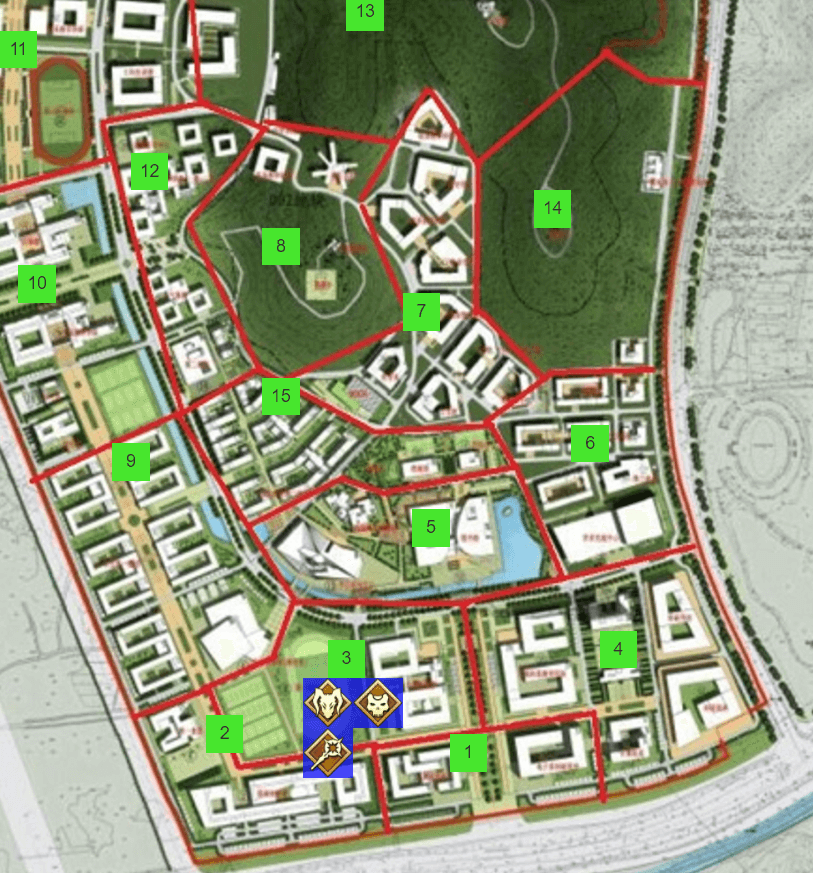
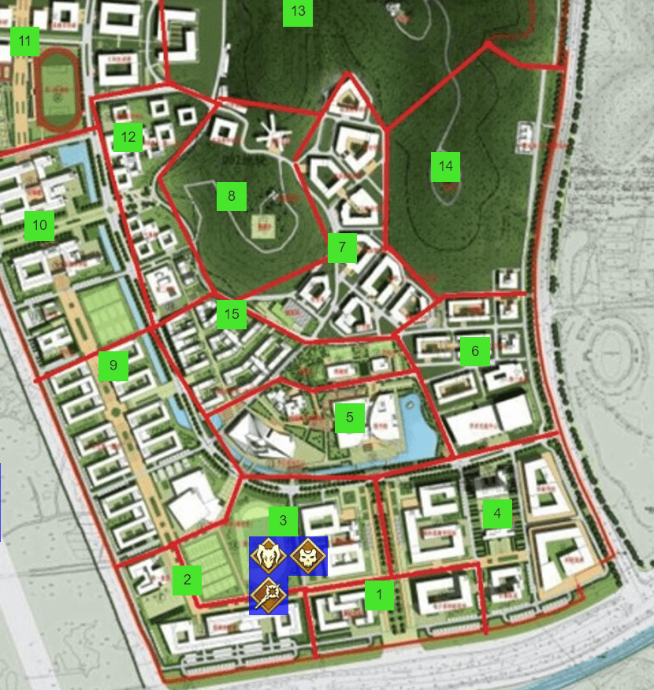
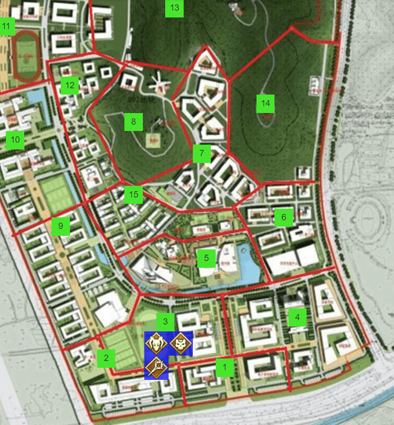
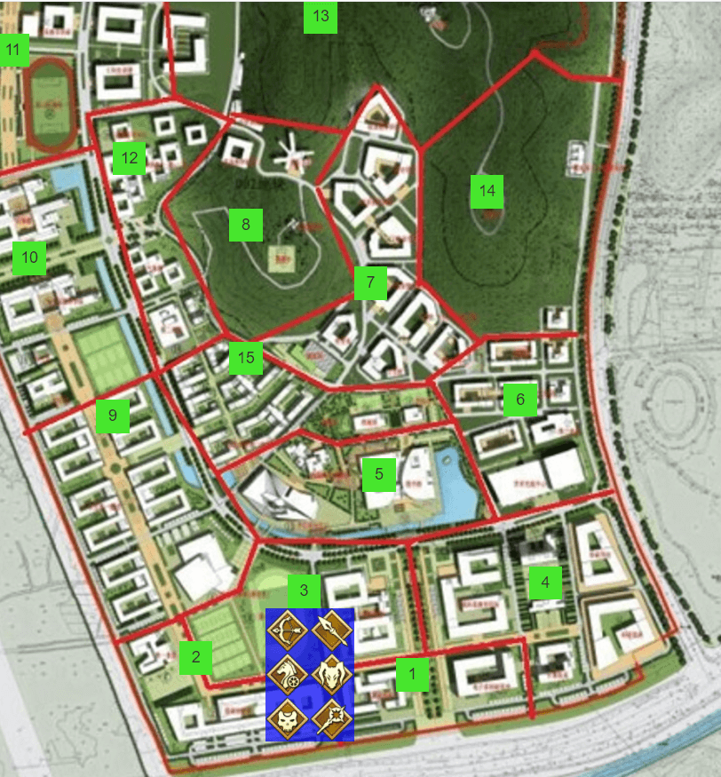
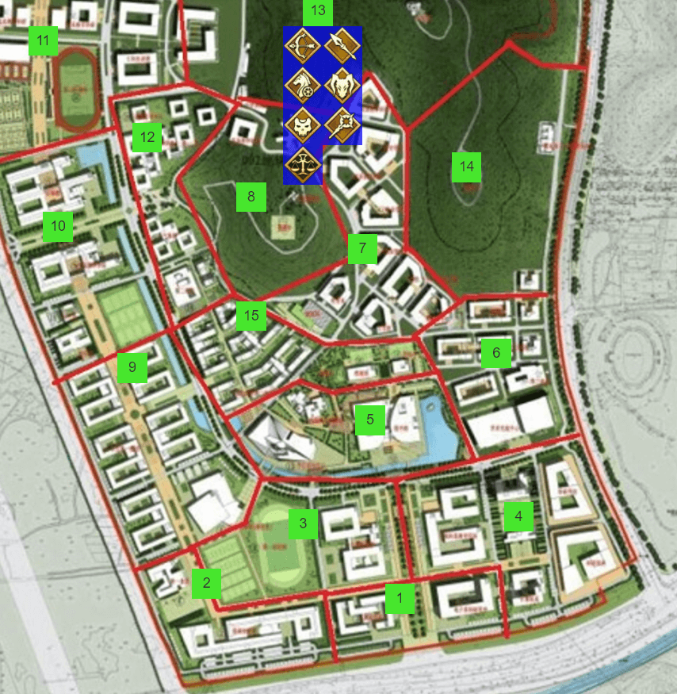

# 第二次圣杯战争
## 第四章 脆弱的联盟
Player-**鱼鱼台**视角

### 周三 上午6：00-上午9：00

 
**剑道**和**拉文**睡醒了，两人看到了正在制作新的机械鸟的**鱼鱼台**，同时也注意到了**鱼鱼台**眼睛下的黑眼圈，看起来**鱼鱼台**似乎一晚上都没睡的样子。而**鱼鱼台**此时也注意到了他们醒来了。

【昨天你们睡觉之后，我把安装有**剑道**所制的液体毒药的机械鸟在学校里进行巡逻，然后在8区的后山发现了1个魔力波动，我以为对方是贞德小姐就向其靠近，结果在靠近到对方身边刚准备开口询问情况的时候，我的机械鸟就被打爆了】**鱼鱼台**一边制作着新的机械鸟一边抱怨着。

【如果是贞德小姐的话，应该不至于直接击落你的鸟，那么有没有可能是那三人组中有两人正在解除凭依进行休息？】**拉文**说出了自己的推理。

【如果真是那样就太好了，我的毒液对非凭依状态下的普通人可是能造成大量伤害的】**剑道**估算了一下，同时他也注意到**拉文**和**鱼鱼台**对自己露出警惕的神色。【嘛嘛冷静一下不要担心，我不可能袭击你们的，如果袭击你们的话我也没有任何赢过那三人组的可能性对吧】

**鱼鱼台**没有放下对**剑道**的警惕【如果正如你所说的一样，那么他们一定是受到不少的伤害，同时因为地区正好为无人的8区，我认为这是我们出击的黄金时间】

三人随后进行一番商讨之后，决定让可以进行气息遮蔽的**剑道**带着装有液态毒药的机械鸟按照3-9-8的方位潜入偷袭敌人，然后**鱼鱼台**和**拉文**按照3-5-7-8的路线从7区光明正大的对8区的敌人发动正面突破。随后在机械鸟制成之后，3人分头进行进攻。

【你信任**剑道**吗？】走在7区路上的**拉文**询问着**鱼鱼台**。

【当然不信任他，不过如果没有他的话我们现在也不是那3个人的对手，如果我们有机会成功的削弱那3人的战斗力的话，再找个机会除掉他吧】**鱼鱼台**确保机械鸟的通信功能暂时关闭之后对**拉文**说道。

随后不久，他们两人进入了8区的边界，然而并没有感知到任何魔力。
【看起来他们似乎是受到重创了呢，这下线索就又断掉了】**拉文**露出失望的表情。

【喂，听得到吗？这里是**剑道**，我在8区没有感知到除了你们之外的魔力，看起来他们是离开了，那我解除气息遮蔽然后你们过来跟我汇合吧】机械鸟里传出了**剑道**的声音。

**拉文**和**鱼鱼台**对视了一会然后点了点头，随后开始向**剑道**方向移动。

然而正当**鱼鱼台**和**拉文**走到一半的时候，两人同时感知到了正前方80范围的树林中凭空出现了两个魔力，随着**折原**的一声【王之军势】，**拉文**和**剑道**同时感知到了**鱼鱼台**和其他的魔力消失了。

**鱼鱼台**眼前的风景瞬间从后山茂密的树林变成了荒凉的沙漠，还有无尽的大军以及面带胜利笑容的**折原**，**小古**和**枫酱**。

【还不逃跑吗，**鱼鱼台**。你在我们三个人和我的大军面前毫无胜算！现在，所有士兵发动进攻！】**折原**带着胜利的表情嘲讽道，随后挥出双手，将自己的军略和强大的领导力布置给所有的士兵。

【哦？是吗？要跑逃跑的，是你们才对。】**鱼鱼台**面无表情地对着三个人说到。

【怎么回事，士兵怎么没有发起进攻？】**折原**突然意识到似乎有什么不对劲，随后，**鱼鱼台**的手臂发出耀眼的蓝光，并且站在原地念着：

【原理，解明】

【机制，解除】

【结界，反制】

【拟态，构成】

【宝具，再现】

【王之军势！】
突然一瞬之间，**折原**注意到自己周围士兵全部消失了，而**小古**和**枫酱**的位置似乎被调整到离自己很远的地方，随后，无穷无尽的机器人大军不断显现，包围了自己，而站在自己面前的，不仅仅有**鱼鱼台**，**拉文**似乎也手持长戟站在自己的面前。自己完全处于绝望的被包围的境地。

【怎么可能，王之军势，居然变成你的宝具了】**折原**似乎不敢相信自己的眼睛。

【勇敢的士兵们，听我的号令，向这位曾经的征服王发起攻击！】**鱼鱼台**手臂一挥，将领导力赋予给了全体军队，随后士兵们犹如潮水一般向**折原**发起冲锋。

【撤退！令咒转移到11区！】**折原**转身向远方的**小古**和**枫酱**大喊道，**折原**比谁都清楚，没有空间转移技能的人，是不可能掏出这个固有结界的，随后自己的令咒闪过一阵红光，从沙漠之中消失了。

紧接着，**小古**和**枫酱**手上的令咒也闪过一阵红光，随后也从沙漠之中消失了。

【你这是怎么做到的，莫非是你的宝具？】，**拉文**不可思议的看着眼前发生的这一切，立刻问到**鱼鱼台**。

【这是我的宝具【万能之人】的显现，我可以解析敌人的宝具，随后瓦解和反制对方的宝具，不止如此，我还可以将其完美复制再现，转换为自己的宝具】**鱼鱼台**看着围绕着自己的士兵和**拉文**说道。【怎么样，只要有我在，王之军势也只是我的囊中之物，只要我们联合起来对抗那3人也不是什么难题，不过现在我只有一个心头之患，那就是**剑道**，我无法复制他的宝具，不然我自己就会中毒而亡。只要你能和我一起解决掉他们和**剑道**，我可以和你结盟到剩下我们两个人为止，不然我现在就可以解决掉你】

【你这是威胁我么，不过这个提案对我来说也并没有那么坏，盟约成立】**拉文**若有所思了一会，然后答复到。

【另外我的斥候向外面侦察的结果告诉我，**剑道**在我们进入结界之后直接当机立断逃走了，看来还真的是一个靠不住的人呢，以后也要小心点他。】**鱼鱼台**劝告**拉文**。

【那么我们该如何向他解释我们击退了他们呢，我不希望让他知道你的身份。不如这样，就跟他说是我用宝具轰穿了他的结界，随后他们就被吓跑了，虽然可信度不高，但是可以好好隐藏住你的真名，你意下如何呢，达芬奇先生】**拉文**回答道。

**鱼鱼台**表示同意之后，解除了固有结界，并且随后和**拉文**一起返回了3区体育馆并且遇到了在里面的**剑道**。**剑道**对两人的解释表示非常惊讶但是还是相信了两人的解释。

随后因为庞大的魔力消耗，**鱼鱼台**和**拉文**决定进行6小时的深度睡眠，而**剑道**也表示自己也进行浅度睡眠，随后三人都睡了过去。

### 周三上午9：00-下午3：00

 
三人均在3区体育馆内进行睡眠，其中**鱼鱼台**和**拉文**进行了深度睡眠，**剑道**进行了浅度睡眠。均没有被打扰惊醒。

### 周三下午3：00-下午6：00

 
【你们之中有内鬼】

3人于6点醒来之后同时看见了放在3人身边的一张纸条。随后**鱼鱼台**，**拉文**和**剑道**陷入了一阵沉默，三个人看到纸条之后的脸色都不是很好。

【这算啥玩意？低劣的反间计吗？】**剑道**率先打破了沉默，以嘲笑的语气说道。

【这是怎么做到的……明明在我的阵地之内，就这么大摇大摆的在我们的身边放了一张纸条……这是在嘲讽我们吗？】**鱼鱼台**一边嘟囔着一边陷入了深思，并且观察着另外两人的表情。

【应该是对面有什么隔空传送的技能吧，不然绕过结界做到这件事真的不太可能吧……还是说，是我们自己有人写的这张纸条然后装作不知道……】**拉文**一边说着一边冒着冷汗。

**鱼鱼台**，**拉文**和**剑道**在之后又陷入了尴尬的沉默，三个人都在互相观察着对方的神态。

【算了管他呢，我先出去巡逻一下顺便找一下逃走的那3人的位置，你们如果没休息够的话就继续休息吧】**剑道**率先站了起来扔下一句话之后走了出去。

在**剑道**走出去之后，**拉文**看着**鱼鱼台**说道【你觉得是谁做的这件事？】

【谁知道呢，我只能说做这件事的不是我】**鱼鱼台**意味深长的看着**拉文**。

【嘛，总之让他先去侦察好了，我的MP还不是很充足，就先继续睡了】**拉文**说完之后继续找到一个座位进行睡觉。

【明明之前就没怎么使用过技能，反而“睡”得比谁都多呢】**鱼鱼台**本想说出这句话然而最后想了想还是算了，随后自己也陷入了睡眠之中。

### 周三下午6：00-下午12：00

 
【我回来了，我在学校左半部分包括8区转了一圈，没有发现他们的踪迹。】**剑道**走进了体育馆并且大声向浅睡中的两人报告道。

【只不过，在我巡逻的时候，我能感受到一股让人不舒服的视线，我可能被人跟踪了】**剑道**面色沉重的补充道。

【他们之中似乎是有一个能隐藏气息的人，似乎是**小古**吧，不过我不觉得他会是单独出来行动的人】**拉文**分析着。

【意思是贞德小姐吗，不过她身上还是有不少谜团呢，不过也不能排除是**小古**的可能性】**鱼鱼台**说出了自己的判断。【不过现在问题不在她身上，我现在还需要回复一些魔力，我们等到晚上12点之后出发向那3人发起决战吧】

随后，**鱼鱼台**继续陷入了深度睡眠，当然，**鱼鱼台**是清楚自己的魔力回复的差不多了，他担心的是他的宝具【万能之人】尚处于冷却之中，他又不想让**剑道**知道自己的身份，所以只能以这个借口拖延一点时间。

### 周四凌晨0：00-上午6：00

 
【**鱼鱼台**快醒醒，有两个魔力正在从4区边界进入了3区，应该是他们来发动强袭了】**拉文**神色慌张的推醒了**鱼鱼台**，**拉文**清楚没有**鱼鱼台**自己是无力对抗那三人的。

**鱼鱼台**在被推醒之前就其实已经醒来了，他的结界早已告诉他对方的入侵，但是入侵的位置确非常的异常。

【我的结界感知到了，他们有三人，不出意外的话是有一个能隐藏魔力气息的**小古**，但是这不是重点，他们的入侵地点是，天上】**鱼鱼台**向另外两人汇报了自己感知结果。

【是那个会飞起来的弓兵吗？不对，应该是利用了Rider伊斯坎达尔的宝具才能做到的飞行，那么这样的话，应该是三人坐着【神威车轮】过来的了！】**拉文**分析了情况。【可恶，按照他们的策略，应该是飞到上空进入射程之后使用【王之军势】来抓我们其中的一个人进去逐个击破，该怎么办】**拉文**一边说着一边用眼睛的余光瞥向**鱼鱼台**。

这是**鱼鱼台**最担心的情况，他的宝具需要到凌晨3点才能好，然而现在已经情况紧急，看来只能使用非常手段了。

随后**鱼鱼台**手上的令咒闪过了一阵红光，使用了令咒重置了【万能之人】的冷却，不过此时**鱼鱼台**更需要的是【万能之人】解析得到的【王之军势】。随着结界对三人的距离的感知，对方越来越接近自己了，终于，对方进入了【王之军势】的射程。

虽然考虑到**剑道**在附近，但是此时情况紧急，**鱼鱼台**也顾不上**剑道**了，**鱼鱼台**解放了宝具，并且喊出了【王之军势】。

然而什么都没有发生，**鱼鱼台**也陷入了疑惑，同时他也确认了自己的魔力已经确认被扣除了，同时自己的【万能之人】也进入了冷却，这是**鱼鱼台**怎么都想不到的糟糕事态了。但是所幸，**鱼鱼台**感知到了上空的3人调转方向开始向9区移动，并没有再次接近。

【我明白了，这应该是固有结界对撞导致的互相抵消的结果，不过我这里情况也不好，宝具进入了冷却，我建议还是原地休息吧】**鱼鱼台**的英灵知识告诉了他这个情况的原因，同时也提出了自己的方案。

【真的吗？我觉得现在是趁势追击的好机会，你们不愿意出击的话那我一个人先去追击了。】**剑道**说完立刻开启了气息遮蔽随后向着9区冲了过去。

【不追过去真的好吗？】**拉文**问向**鱼鱼台**。

【现在追过去也无法与他们对抗啊，我的宝具这次可是用令咒强制刷新的，结果和对方大帝的宝具互相抵消了，早知如此我就等他先拉我进去之后再反制他了】**鱼鱼台**露出懊恼的表情。

【但是这样的话如果我们之中有人被他单独拉进去怎么办，你要是没有进去的话，我或者**剑道**被拉进去就完蛋了，你的选择救了我们，你不需要因此自责！】**拉文**露出认真的表情，看着**鱼鱼台**。【而且虽然说我们信不过**剑道**，但是起码现在来说他也是我们坚定的盟友，如果他想杀死我们，他早就出手了，我们不能放任他陷于陷阱之中不管他！】

**鱼鱼台**沉思了一会，随后站起身，牵着**拉文**的手走出体育馆。【说的是呢，只要我们三人联合起来，总归是能找到战胜的方法的，我很抱歉之前过于警惕你们了，我们现在去9区帮助**剑道**吧】随后两人向着9区跑了过去。

当**鱼鱼台**和**拉文**快要赶到9区边缘的时候，突然感知到有一个魔力凭空出现在了体育馆内。
【看起来**剑道**遭到袭击了呢，我们先在这里等他吧】

随后不久**剑道**气喘吁吁的赶到了两人的身边。
【快追！详细的事情之后一边追一边跟你们说！】

于是三人进入了9区，感知到3个魔力正在向10区移动，于是三人继续穷追不舍，来到10区之后虽然没有感知到魔力，不过他们判断应该就在附近不远处，于是向13区追过去。

在追逐的过程中，**剑道**汇报了他遇到的事情。
【我开着气息遮蔽追到了9区，随后感知到了他们的魔力在天上，但是因为天色太暗我看不见它们的具体位置，随后我准备攀登上3栋宿舍的楼顶去观察，然而就在我攀登到一半的时候，我感知到他们突然迅速向我逼近并且将我拉进了王之军势里，随后我果断使用了令咒转移出来，他的宝具应该是使用令咒刷新了冷却，所以现在是追击的最好机会】

在**剑道**报道他情况的时候，**鱼鱼台**也逐渐的放下了心防，并且继续紧追着那3人的动向来到了13区。

 

【13区的中部感知到了……四个魔力】率先开着气息遮蔽进入13区的**剑道**回头向**鱼鱼台**和**拉文**汇报道。

【四个魔力……是贞德小姐吗？不能让他们拉拢到贞德，我们出发！】**鱼鱼台**立刻拽着**拉文**进入13区并且向着魔力方向前进。

【有一个魔力似乎和那3个魔力分开了，单独的魔力向7区前进，然后另外3个魔力似乎向14区快速前进，我们应该追哪一个？】**拉文**询问另外两人。

【继续追着那3个人，现在是为数不多的机会，不能就此放过！他们一直在逃跑也恰恰证明了他们很虚弱！】**剑道**指挥着。

**鱼鱼台****拉文**和**剑道**很快追到了14区，随后感知到3人的魔力进入了6区边界，之后当他们来到6区的时候已经感知不到魔力了。

【这样只能进行地毯式搜索了呢，我和**鱼鱼台**搜索6区，**剑道**你和机械鸟搜索5区，分别搜索1小时应该可以搜查完毕，如果都搜查不到的话我们准时3点在4区回合一起搜查4区！】**拉文**此时也做出了决策。

（看起来找到了两个信得过的靠谱队友呢）**鱼鱼台**暗中庆幸着。

三个人分头展开搜索之后，均没有找到敌人，随后三个人在4区完成汇合。

【4区从战争开始就一直是他们的老巢，这里也是他们最有可能的藏身地，搜查的时候一定要全程警惕，知道了吗？】**拉文**想起**罹殇**的经历，不由自主的提醒道。

三人搜查完其他建筑物之后，最终来到了计科楼。随后开始逐层进行搜查。

当来到计科楼10楼的时候，走在前面的**鱼鱼台**推开了实验室的门，突然，从阴影之中**小古**手持长枪突然出现以精准狠辣的架势向**鱼鱼台**袭击。

虽然没有听到**小古**解放宝具名，不过这一瞬间**鱼鱼台**似乎感到有什么地方不对劲，随后**鱼鱼台**当机立断使用令咒重置了宝具【万能之人】的冷却并且试图对**小古**这次的进攻进行解析。

【原理，解明】---这不是传统的依靠魔力发动的宝具，是用【气】的概念进行的【神枪无二打】，一旦被击中的话后果不堪设想。

【机制，解除】---但是既然是凡人的宝具，就一定会存在可以突破的地方

【拟态，构成】---虽然我无法使用【气】，也没有【神枪】，但是似乎依然可以用魔力来进行模拟，但是我手上没有枪作为武器，真的可以复制成功吗？

【宝具，再现】---对【无二打】进行具体解明，发现了，这似乎并不一定需要长枪才能发动，用双拳就能对【无二打】进行再现！

【钢拳无二打！】
**鱼鱼台**手中的双拳发出了蓝色的光芒，随后**鱼鱼台**轻松的拨开了**小古**的枪，并且直接发现并且瞄准了**小古**暴露出的身体要害，一记钢拳将**小古**直接击退到旁边的墙上。被完全集中要害的**小古**爬倒在地口吐鲜血，似乎已经快要完全失去作战能力了。

而目睹到这个情况的**剑道**也没有犹豫，当即掏出匕首向着**小古**飞奔而去并且扎向倒地的**小古**，**小古**用尽全身最后的力量发动了令咒，随后令咒闪过了一道红光，**小古**消失了。

【看到了吗，你们是没有胜算的，早点投降吧，如果还想抵抗的话，你倒是再使用一次王之军势啊**折原**】**鱼鱼台**确定**小古**消失之后，对着躲在实验室后方的**枫酱**和**折原**说道。

【不会如你所愿的！哪怕是奋战到死我们也不会投降的！】**枫酱**一边说着一边射出带有附魔的弓矢，**鱼鱼台**试图躲闪但是被弓矢直接命中，被射倒在地。

【哼，反抗还很激烈的啊，但是我还有两个战友你们可不要忘了，现在是3对2，没有魔力释放王之军势的你们还能做到什么！很快**拉文**和**剑道**就会帮我终结掉你们的】**鱼鱼台**听到了背后**拉文**展开宝具的声音，然后擦干嘴角的血，爬起身来对着**枫酱**和**折原**喊道。

**鱼鱼台**转头看到**拉文**宝具充能完毕，然而，**鱼鱼台**却看到，**拉文**瞄准的不是**枫酱**和**折原**，而是自己。

【**拉文**！你在做什么！快住手！】
随着**鱼鱼台**的叫喊，**拉文**释放出了宝具，一柱巨大的光束冲击向了**鱼鱼台**。

【哼，这下有点意思了，看起来，我登场的时刻快要到了】
站在楼梯间内的某人露出了笑容。
附录：英灵卡
【职阶】Caster
【真名】列奥纳多·达·芬奇
【性别】女（身体）
【武装】全战局对应型万能护臂&法杖
【能力值】
筋力：E
耐久：E
敏捷：C
魔力：A+
幸运：B
宝具：EX
HP=7
MP=360
【职阶技能】
阵地作成 A
主动
冷却时间72小时
选定一个区域，用6个小时的时间去制作阵地，之后在这个区域内的魔力回复增加50%
一旦任何英灵包括assassin进入阵地，不论是否处于重度睡眠，均可以立刻察觉。
处于阵地内，达·芬奇的任何行为均可以获得一个奖励骰。

道具作成 A
消耗30MP，3小时时间
可以制作带有魔力的器具。
达芬奇可以制作机械鸟作为侦查用的使魔。达芬奇可以把机械鸟配置在任何位置并相互感知。机械鸟可以感知魔力，进行侦查。它有无法隐藏的，小于英灵的魔力波动。没有相关技能的英灵在进入有机械鸟的区域时并不能感知到，但是如果进行搜索或者在区域内停留超过三小时则一定会发现它。
机械鸟同时只能存在一只。
此外，达芬奇生前的发明也可以进行制作，具体效果和消耗不定。
【保有技能】	
天赋的睿智	EX
主动
消耗50MP
冷却时间6小时
可以在以下技能中选择一项并获得其效果。
黄金律：A 千里眼：B 重摆架势：B 领导力：A 高速咏唱：A
黄金律：A	
被动技能，使自己每次魔力回复效果提高60%
千里眼：B
指定一个区域，自己可以侦察到区域内的英灵、大型单位及值得你注意的普通人。
重摆架势：B
在战斗中可以随时使用，解除自己身上所有不利状态，回复1点HP，下一次行动如果是撤退则必定成功。
领导力：A
对任意名【己方】单位使用，下一次攻击行动多一个奖励骰。
高速咏唱：A
立即获得100点MP。

黄金律（体） B
消耗30MP
冷却时间18小时
在接下来的3小时内，获得不受异常状态影响；每小时回复20MP；每3小时回复1HP的状态。

星之开拓者 EX
消耗5MP
冷却时间72小时
开启之后，下一次攻击或者宝具无视敌方的闪避和防御，并且自己获得100MP，可以突破MP上限
【宝具】
宝具名：万能之人（Uomo Universale）
等级：EX
种类：对人宝具/对军宝具
范围：？
最大捕捉：？
魔力消耗：？
宝具介绍
被动：在观察到一个宝具的发动后，瞬间解析对象，之后可以将其拟态构成，达到反制或者复制效果。（不会提前得知对方的魔力消耗）

反制的场合，消耗的MP是对方宝具的2倍时，将其完全反制。冷却时间：36小时。

复制的场合，消耗的MP是原宝具2倍时，可以正常获得观测到的效果。

反制和复制同时使用的场合，消耗的MP是对方宝具3倍时，即可反制+复制使用对方的宝具。
冷却时间：24小时。

