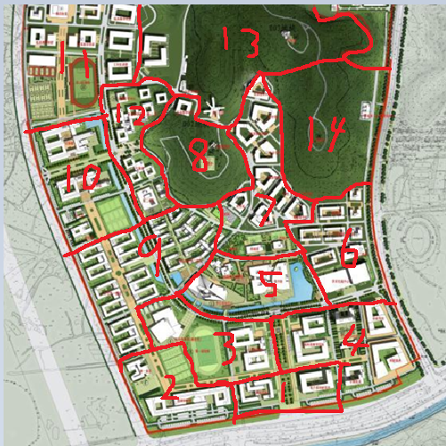

# Fate/Phantom

### In NJU

| 版本历史 | 内容 | 修订人 | 
| --- | --- | --- |
| V1.4 | 附加基础战斗规则 | 威大鸡 |
| V1.3 | 修正部分内容 | 威大鸡 |
| V1.2 | 魔力回复优化 | 威大鸡 |
| V1.1 | 战斗优化 | 威大鸡 |

## 一．序幕（全体通用）
那是一个平常的清晨。
你睡眼朦胧地躺在自己宿舍的床上，周日的早上并没有太早起的必要，这么想着的你打开手机准备确认一下现在的时间。
“未读短信，来自辅导员，发送时间 0：00”
是辅导员的短信吗，我最近有做过什么不好的事情吗？而且这发送时间选的真不错呢，带着疑惑，你打开了这封短信。
“学校通知：请你于中午12点准时前往后山顶部，请务必参加，否则后果自负”
真是奇怪呢，也没有说是什么事情，感到疑惑的你向辅导员手机电话打了过去，然而在电话响了3声之后直接被挂断了，紧接着过了10秒发过来又一条短信：
“具体事项请12点来后山询问，请务必参加，否则后果严重”
你再三确认了对方确实是辅导员的电话号码没有错，但是不仅短信内容含含糊糊，而且语气也不像辅导员平日的语气。既然这样的话，也只能去现场看一下情况了。作为南大优秀学生的你，还是有点顾虑到短信里提到的严重后果的。
那本该是一个平常的清晨。

吃完午饭之后，你拿出手机确认了一下时间，正好11点40，看来还赶得上去后山。
你来到后山脚下，却发现唯一的上山通道似乎被几名你不认识的工作人员挡住了，你走上前却被拦了下来，“请出示学生证”，被这么要求的你出示了你的学生证，工作人员收下之后仔细的和手上的像名单一样的纸张对照着，你似乎勉强可以看到纸张上写着大概7名学生的信息，在他仔细来回对照好几次之后，他把学生证还给你并且示意你进去。从他们的表情上你读出似乎在这里问不到什么，只能慢慢走上了后山。
走到了后山山顶之前，你拿出手机再次确认了一下时间，11点59，看来自己差一点就迟到了。随着视野的慢慢平缓，你看到了面前的总共6个同学和一位西装革履的“老师：。看来自己是最后一个到的呢。
这位看起来像老师的人看到你上来的同时，还没等在场的任何同学开口，便大声说道：“看来人都到齐了，接下来在我允许你们说话之前，不允许有任何人插嘴发言，那么，首先，恭喜各位，你们已经告别了日常的生活了”
你们面面相觑，你能感受到同学脸上的疑惑，似乎大家都是被这么莫名其妙的喊到这里的，“那个，请问这是什么意思呢？“你正准备这么举手问出来，然而在喉咙刚刚要发出声音的时候，突然感觉嗓子一阵刺痛，喉咙如同被掐住一样发不出声音。
”我说过，不允许有人说话“，你抬头看到西装革履的“老师”将手对着你，而“老师”手背上似乎有好像是红色的符号的印记，而令人惊讶的是似乎有个痕迹暗了下来，而很快又变回了鲜红色，在大家的惊愕之中，“老师”举起手背对着你们，“我是这次的监督者，但是除了这次说明会之外我不会直接参与你们的战争，你们的圣杯战争，那么各位同学们，哦不对，各位英灵们，请再次记住，你们接下来的一周里，已经彻底告别了日常生活了，欢迎来到魔术师的世界！“
真是奇怪的一天，你满脑子的疑问但是喉咙依然完全发不出声甚至身体也无法移动，一头雾水的你希望接下来的说明能更让人接受一点。===》接KP

## 二．英灵卡
【职阶】  
【真名】  
【性别】  
【武装】  
【能力值】  
筋力:  
耐久:  
敏捷:  
魔力:  
幸运:  
宝具:  
HP状态：  
MP=  
【职阶技能】  
  
【保有技能】   
  
【宝具】  
宝具名  
等级：  
种类：  
距离：  
最大捕捉：  
魔力消耗：类型，耗魔  
宝具介绍  

## 参考规则：（第一次试玩超级简化版）
#### 1.英灵召唤
英灵为凭依召唤于pc身上，具体技能和属性可以参考fgo设定
于说明会结束后，周日12点-24点内自己选择校内任何一处均可召唤，24点后正式开始圣杯战争。

#### 2.能力数值与MP
属性对应数值E=20 、D=30、C=40、B=50、A=60 EX=70
MP=魔力*职介倍率
职阶MP倍率
Saber 4
Archer 5
Lancer 4
Rider 5
Caster 6
Assassin 5
Berserker 3

#### 3.宝具的消耗（参考魔耗，具体消耗根据英灵情况和KP商讨）
·C级：30点MP
·B级：40点MP
·A级：50点MP
分为解放型，常驻型。
解放型每次计算一次魔耗，常驻型每个大回合计算一次魔
宝具等级中带有+号表示魔耗比同等级要多，接近翻倍，例如A+级宝具要比A级宝具魔耗多出40MP左右。
其他主动技能的mp消耗由KP判断（需告知pc）
MP回复方式参见条目14.

#### 4.HP和轻伤重伤
不设定HP，而是采用伤害累计的方式决定从者的身体状况。当从者受到攻击后，KP会对此伤害进行判定，伤害种类分为轻伤和重伤，3次轻伤=1次重伤，3次重伤=死亡。

#### 5.行动回合
每天分为6个大回合-早上6-9点，午前9-12点，午后12-15点，下午15-18点，晚上18-24点，深夜24-6点
每个pc在大回合开始的时候私下对kp说出自己的行动安排，然后由kp推动每个大回合发生的事件。

#### 6.令咒机制
每人初始持有3个令咒：
令咒的使用方法多种多样，具体方式可以由pc自己思考
在战斗中使用令咒不占用行动回合

#### 7.战斗回合和指令
战斗时由敏捷高者先进行行动，之后按照敏捷排序轮流进行行动
自己的战斗回合可选择的指令有
攻击 使用技能 战技 宝具解放 移动
每个战斗回合只能使用一个指令（令咒除外）
防守方回合可以使用的指令有
针对攻击-----反击，闪避，防御
针对战技-----战技，闪避，防御

#### 8.攻击（近身）
攻击可以选择三种攻击方式，分别为力量攻击（筋力），迅捷攻击（敏捷），技巧攻击（魔力），
#### 9.防守指令
防守方会根据距离获得对方行动动向，并且将进行防守选项
对于回避的判定-----防守方进行回避时 所有攻击会和防守方方的敏捷进行对抗 对抗每成功一级则对防守方多一次轻伤判定 同级和失败对双方无影响
对于反击的判定-------防守方进行反击时 攻击会和防守方选择的反击类型（力量，迅捷，技巧）进行对抗 对抗同级则对防守方造成一点轻伤 每成功一级追加一点轻伤判定 失败则进攻方受到成功级别差的轻伤判定，防守方固定收到一点轻伤。
对于防御的判定----------防守方选择防御时 攻击会和防守方的耐久（物理防御）或魔力（魔法防御）进行对抗 魔力防御在对抗近战攻击的时候需要添加一个惩罚骰。进攻方对抗失败不造成负面影响 进攻方对抗同级和成功无论级数差距均只造成一点轻伤，面对物理防御时，成功级数差为2级时，防守方会受到崩防效果，跳过自己下一个行动回合，差为3级及以上时，防守方跳过自己下两个行动回合。魔力防御没有崩防效果，每次使用固定消耗10MP.

#### 10.移动（逃跑）
战斗轮中，移动将进行敏捷判定，根据判定结果决定移动距离，
（大失败无法移动，失败为半数敏捷数值，成功为移动敏捷数值，大成功则为1.5倍敏捷数值，极大成功则为2倍敏捷数值）
距离移动到地图边缘所需的距离取决于开战位置和地图大小，标准地图中心到边缘的距离为150.大型地图数值会变大。

#### 11.追击和攻击距离
标准近战武器可于双方距离在40以内时发动攻击，并且可以达到防守方身边。距离不够则无法进行攻击选项。
标准远程武器可于双方距离在120以内（中间需无阻碍）发动攻击，其中80-120距离时攻击会产生一个惩罚骰，近战防守方只能进行回避和防御，40-80距离攻击无影响，近战防守方只能进行回避和防御，0-40距离近战防守方可以进行反击，同时距离拉近为0.远程防守方均可进行反击。

#### 12.感知与观察
当和其他英灵处于同一区域时，对方没有气息遮断的情况下可以被感知，（未凭依状态则无法感知）
战斗中取决于距离不同可以观察到对方的行动从而决定自己的防守指令。

#### 13.凭依
未凭依状态遭受攻击命中直接为重伤判定，遭受伤害宝具命中直接死亡

#### 14.休息与魔力回复
参与的学生均为普通人，长时间不进行休息睡眠将会极大的影响魔力回复
连续超过18个小时的行动之后，学生每进行6小时的行动将会获得一层疲劳，可叠加（进行不满6小时的休息也算作行动，无法清除或者不叠加疲劳），每次获得疲劳时候将消耗20*疲劳层数的额外MP。疲劳层数将于连续6小时以上的休息之后全部移除。。
休息有两种指令：要清除疲劳至少需要6小时的休息 
深度睡眠------不会被周边发生的情况所弄醒，睡眠期间无法感知周围的情况，每3小时回复总MP值四分之一的MP。
浅度睡眠------周围100距离内发生魔力波动或者有英灵接近时会及时醒来，但是回复效果不佳，每3个小时回复总计MP值六分之一的MP。
假装睡眠吸引敌人攻击是允许的，但是假睡不列入休息范畴
每天的24：00会给每个学生30MP的固定魔力回复。
圣杯战争中允许其他魔力回复方式，具体方法由玩家自行寻找
体力恢复为每三天半自然恢复一点轻伤，耐久每高一级减少半天的间隔。（E级耐久为3天）

附录：战斗系统的基础规则（采用COC规则）
战斗时的对抗会根据双方所选择的指令对应的属性roll100面骰，大于判定属性就是失败 二分之一到属性值是普通成功 四分之一到二分之一是大成功 低于四分之一为极大成功，1为究极无敌大成功，96-100为极大失败

而一旦出现奖励骰和惩罚骰，比如一个奖励骰，会先roll个位数，然后roll两个十位数，奖励骰就是取低的十位数，惩罚骰就是取高的十位数。

## 三．地图

大致区域划分：（处于同一区域内可以产生感知）
区域1：正门口区域（包含逸夫楼等周边建筑）
区域2：实验楼-456食堂区域（包含篮球场）
区域3：足球场-教学楼区域（包含体育馆）
区域4：行政楼区域（包含计科楼）
区域5：图书馆区域
区域6：10食堂区域（包含周边宿舍）
区域7：院系楼区域（包含后山右侧区域的院系楼）
区域8：后山
区域9：宿舍区域
区域10：环科楼-化学楼区域（包含网球场）
区域11：副足球场区域
区域12：9食堂区域（包含小河右侧建筑群）
区域13：北部深山区域
区域14：东部山区
 
