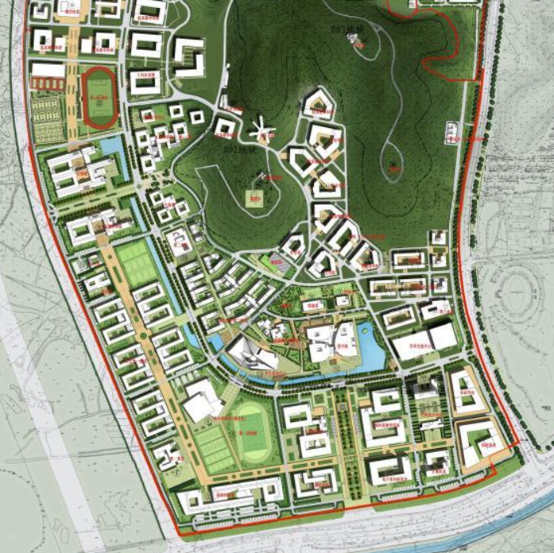
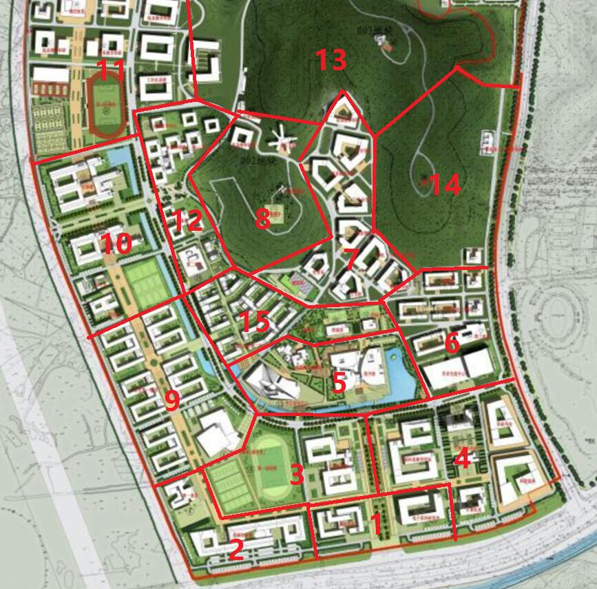

# Fate/Phantom V2.0

### In NJU

| 版本历史 | 内容 | 修订人 | 
| --- | --- | --- |
| V2.0 | 简化和平衡防御细则 | 全体制作组 |
| V1.9 | 更新地图、凭依MP、规则修订 | 威大鸡 |
| V1.8 | 大幅简化 | 神速 | 
| V1.7 | 对抗、等级数值、令咒限制、序幕 | 神速 | 
| V1.6 | 格式优化 | 神速 | 
| V1.5 | 血量、凭依等重大调整，细化描述 | 威大鸡 |
| V1.4 | 附加基础战斗规则 | 威大鸡 |
| V1.3 | 修正部分内容 | 威大鸡 |
| V1.2 | 魔力回复优化 | 威大鸡 |
| V1.1 | 战斗优化 | 威大鸡 |

## 一．序幕 - 第三次圣杯战争
那是一个平常的清晨。
你睡眼朦胧地躺在自己宿舍的床上，周日的早上并没有太早起的必要，这么想着的你打开手机准备确认一下现在的时间。
```
未读短信，来自辅导员，发送时间 0：00
```
是辅导员的短信吗，我最近有做过什么不好的事情吗？而且这发送时间选的真不错呢，带着疑惑，你打开了这封短信。
```
学校通知：请你于中午12点准时前往后山顶部，请务必参加，否则后果自负
```
真是奇怪呢，也没有说是什么事情，感到疑惑的你向辅导员手机电话打了过去，然而在电话响了3声之后直接被挂断了，紧接着过了10秒发过来又一条短信：
```
具体事项请12点来后山询问，请务必参加，否则后果严重
```
你再三确认了对方确实是辅导员的电话号码没有错，但是不仅短信内容含含糊糊，而且语气也不像辅导员平日的语气。你突然想到，之前在三组团附近发生的自行车集体爆胎事件，南区实验楼进行的紧急施工，以及院里一些同学莫名消失一周的事件。莫非与这些事情有所关联？脑海里面瞬间浮现起很多可能性，作为南大优秀学生的你，还是有点顾虑到短信里提到的严重后果的。

你准备着手去上网查资料，试图验证自己的猜测。你发现了前段时间发现在南大的一些事情的传闻，以及随即带来的一些更加久远时期的参考资料。这些内容非常难以搜索，看得出来有人为被掩盖的痕迹。然而没有搜索多久，你发现自己的网络账号被封禁，访问所有的页面，都显示着：
```
具体事项请12点来后山询问，请对其他人保密，否则后果严重
```

既然这样的话，也只能去现场看一下情况了。

吃完午饭之后，你拿出手机确认了一下时间，正好11点40，看来还赶得上去后山。  
你来到后山脚下，却发现唯一的上山通道似乎被几名你不认识的工作人员挡住了，你走上前却被拦了下来，“请出示学生证”，被这么要求的你出示了你的学生证，工作人员收下之后仔细的和手上的像名单一样的纸张对照着，你似乎勉强可以看到纸张上写着大概7名学生的信息，在他仔细来回对照好几次之后，他把学生证还给你并且示意你进去。从他们的表情上你读出似乎在这里问不到什么，只能慢慢走上了后山。  
走到了后山山顶之前，你拿出手机再次确认了一下时间，11点59，看来自己差一点就迟到了。随着视野的慢慢平缓，你看到了面前的总共6个同学和一位西装革履的“老师：。看来自己是最后一个到的呢。  
这位看起来像老师的人看到你上来的同时，还没等在场的任何同学开口，便大声说道：
```
看来人都到齐了，接下来在我允许你们说话之前，不允许有任何人插嘴发言，那么，首先，恭喜各位，你们已经告别了日常的生活了
```
你们面面相觑，你能感受到同学脸上有人疑惑，有人沉思，有位同学正准备举手问问题，然而他却并没有说出话来，眼镜瞪得很大，似乎喉咙被卡住一样。  
”我说过，不允许有人说话“，你抬头看到西装革履的“老师”将手对着他，而“老师”手背上似乎有好像是红色的符号的印记，而令人惊讶的是似乎有个痕迹暗了下来，而很快又变回了鲜红色，在大家的惊愕之中，“老师”举起手背对着你们，
```
我是这次的监督者，但是除了这次说明会之外我不会直接参与你们的战争，你们的圣杯战争。
那么各位同学们，哦不对，各位英灵们，请再次记住，你们接下来的一周里，已经彻底告别了日常生活了，欢迎来到魔术师的世界！
```  
真是奇怪的一天，你满脑子的疑问但是你知道自己什么都不能问。你全神贯注准备听接下来的说明，希望可以解除你今天上午积攒下来的疑问。  

**请各位玩家根据 KP（Veda） 的指示，在本周六（2017-08-19 14:00 GMT+8）到达 YY CAC动漫社综合频道（67715380） 圣杯战争-说明会中，听取说明并等候其进一步安排**

## 二．英灵卡示例
| 职介 | 真名 | 性别 | 武装 | HP | MP |
| --- | --- | --- | --- |--- | --- | 
| Saber | 高文 | 男 | 轮转胜利之剑 | 11 | 240 | 

| 筋力 | 耐久 | 敏捷 | 魔力 | 幸运 | 宝具 | 
| --- | --- | --- | --- |--- | --- | 
| B+ | B+ | B+ | A | A | A+ |

| 职介技能 | 描述 | 
| --- | --- | 
| 对魔力 B | 低于对魔力等级的技能和魔力攻击直接无视，<br />对于B等级的敌方技能判定造成一个惩罚骰 | 
| 骑乘 B | 所有普通载具都能使用，使用载具时移动效果翻倍 | 

| 保有技能 | 描述 | 冷却 | 魔力消耗 | 
| --- | --- | --- | --- |
| 圣者的数字 EX | 自己在晴天的上午9点到12点，下午15-18点之间，所有ROLL点数值除以3 | | |
| 领导力 E | 下一次的攻击提供一个奖励骰，可以给同时给自己和多个目标提供。 | 3h | 10MP |
| 柏希雷克之带 EX | 回复40mp，自己在敌方下一个行动回合如果获得3点以上伤害则减半之。 | 12h | 10MP | 

| 宝具 | 等级 | 种类 | 距离 | 最大捕捉 | 魔力消耗 | 冷却 | 
| --- | --- | --- | --- | --- | --- | --- |
| 轮转胜利之剑<br />Excalibur Gallatin | A+ | 对军宝具 | 40 | 3人 | 80MP 爆发 | 24h |

| 宝具 | 效果 |
| --- | ---| 
| 轮转胜利之剑 Excalibur Gallatin | 对命中的敌方造成3点伤害，并且被命中的敌方下轮行动无法发动技能。晴天白天上午9点-下午15点使用时，追加3点伤害的判定，但是因为效果过于明显极大概率被发现。|

## 三、参考规则：
#### 1.英灵召唤
英灵为凭依召唤于pc身上（请参考魔法少女伊莉雅）。玩家会在说明会得到英灵凭依卡片，于说明会结束后，按照说明会的要求及现有知识进行召唤。
刚执行召唤的时候英灵会进入卡片内，不会进行凭依。

#### 2.凭依
凭依即英灵会附着于玩家身上，而非Master-Servant分离的模式。凭依动作消耗20MP，每轮行动消耗10MP。
凭依时武器会自动进行隐藏，如果特别希望平时就持有武器则需特别声明。凭依不会影响自己的外貌特征表现，除非有特别的技能或者礼装显示。武器默认携带在身上，所以遭遇战斗时可以随时解除隐藏。  
未凭依状态遭受任何伤害，该次伤害均乘以3倍处理。  

#### 3.能力数值与 HP,MP
属性对应数值**E=30、D=40、C=50、B=60、A=70**    
能力值如果带有+号，可以一天一次将该属性瞬间翻倍一次。使用后进入 24h 冷却。而宝具带有+号意味着会消耗更多魔力以达到更大强度的效果。  
宝具和技能分为触发型和常驻型。触发型每次计算一次MP消耗，常驻型每个大回合计算一次MP消耗。
HP值取决于耐久，耐久E的初始最大HP为7，随后耐久每提升1个等级则最大HP提高1点。   
最大MP = 魔力*职介倍率（具体略）。 
以上具体数值将会同英灵卡一起交付玩家，以其为准。  
HP，MP回复部分参考条目12。  

#### 4.常规行动回合
每天分为6个大回合-早上6-9点，午前9-12点，午后12-15点，下午15-18点，晚上18-24点，深夜24-6点。  
每个pc在大回合开始的时候私下对kp说出自己的行动安排，然后由kp推动每个大回合发生的事件。

#### 5.令咒机制
每人初始持有3个令咒。令咒以使用命令的方式，以达到完成本来从者难以达到的事情，其使用方法多种多样。在战斗中使用令咒不占用行动回合。  
一个令咒可以被用于如下用途：
- 侦查中移动到任意区域，或在战斗中移动到相邻区域
- 从不够严重的濒死状态恢复 为生命值为1
- 补充一定量的魔力
- 重置宝具的冷却启动宝具
- 强化一次攻击，使魔力附着于其上，伤害增加
    
考虑到平衡性等因素，以下使用令咒的行为是不被允许，或达不到的：
- 战斗时移动到任意地带
- 在非濒死状态下利用令咒回血
- 提升自己的生命值上限或魔力上限

#### 6.战斗系统的基础规则（采用COC规则）
战斗参考 COC 中双方玩家投掷 100 面骰进行检定，进行结果对抗。

根据属性值和掷骰结果的不同，分为以下几种： 
1：1/50属性： 极限成功  
2：1/5属性： 极大成功  
3：1/2属性： 大成功  
4：1属性以下： 成功  
5：1属性以上： 失败  

而一旦出现奖励骰和惩罚骰，则是再次进行roll骰，奖励骰为取所有骰子结果中最低者，惩罚骰为最高者。  
**注：与COC原版规则相比，取消了大失败，且奖励与惩罚骰子完全重新掷骰子**

#### 7.战斗回合和指令
战斗时由敏捷高者先进行行动，之后按照敏捷排序轮流进行行动
自己的战斗回合可选择的指令有**攻击、使用技能、宝具解放、移动**。  
每个战斗回合只能使用一个指令（令咒除外）  
防守方回合可以使用的指令有  
针对攻击-----反击，闪避，物理防御和魔力防御   
针对宝具-----宝具，闪避，物理防御和魔力防御  

#### 8.攻击与反击
攻击可以选择三种攻击方式，对应使用英灵的不同能力值进行对抗。分别为力量攻击（筋力），迅捷攻击（敏捷），技巧攻击（魔力）。
攻击可以同时声明攻击手段或战技，如借助地形，试图击飞或击落等。游戏鼓励玩家细致描述符合情境的攻击方式，具体效果将由 KP 到时与玩家商议。  
标准近战武器可于双方距离在40以内时发动攻击，并且可以达到防守方身边。距离不够则无法进行攻击选项。
标准远程武器可于双方距离在120以内（中间需无阻碍）发动攻击。  
其中80-120距离时攻击会产生一个惩罚骰，40-80距离攻击无影响，近战防守方只能进行回避和防御；  
0-40距离近战防守方可以进行反击，同时距离拉近为0。  
远程防守方均可进行反击。  

#### 9.防守指令
防守方会根据距离获得对方行动动向，并且将进行防守选项：包括回避、反击、物理/魔力防御   
**回避**：攻击会和防守方的敏捷进行对抗，对抗相同或成功防守方受1HP伤害，之后每成功一级则对防守方多1HP伤害。  
**反击**：攻击会和防守方选择的反击类型（力量，迅捷，技巧）进行对抗，防守方固定受到1HP伤害。双方对抗成功的一方给失败方造成成功等级差的HP伤害。  
**物理/魔力防御**：攻击会和防守方的耐久/魔力进行对抗，魔力防御的防守方每次使用固定消耗10MP，在对抗近战攻击的时候需要添加一个惩罚骰。进攻方对抗同级以上造成防守方1HP伤害；成功及以上时，防守方会受到崩防效果，在下一次行动收到一个惩罚骰。  


#### 10.移动（逃跑）
战斗轮中，移动将进行敏捷判定，根据判定结果决定移动距离：  
失败为移动0.5倍敏捷数值，成功为移动敏捷数值，大成功则为1.5倍敏捷数值，极大成功则为2倍敏捷数值。   
距离移动到地图边缘所需的距离取决于开战位置和地图大小，标准地图中心到边缘的距离为150。大型地图数值会变大。  

#### 11.感知与观察
当和其他英灵处于同一区域时，对方没有气息遮断的情况下将感知到对方的魔力存在，未凭依状态则无法感知。
战斗中取决于距离不同可以观察到对方的行动从而决定自己的防守指令。

#### 12.休息与魔力回复
参与的学生均为普通人，长时间不进行休息睡眠将会极大的影响魔力回复。  
连续超过18个小时的行动之后，学生每**开始**进行6小时的行动将会获得一层疲劳，每次获得疲劳时候将消耗20*疲劳层数的额外MP。疲劳层数将于**累计**6小时以上的休息之后全部移除。完成累计6小时的休息**并醒来**之后重新开始18小时的计数。  
**深度睡眠**：不会被周边发生的情况所弄醒，睡眠期间无法感知周围的情况，**连续**睡眠每3小时回复总MP值四分之一的MP。同时，**连续**进行6小时深度睡眠中途不被打断的话，可以回复1点HP。回血效果触发后进入12小时的冷却。  
**浅度睡眠**：周围100距离内发生魔力波动或者有英灵接近时会及时醒来，但是回复效果不佳，**连续**睡眠每3个小时回复总计MP值六分之一的MP。浅度睡眠不会回复HP。  
圣杯战争中允许其他魔力回复方式，具体方法由玩家自行寻找。  


## 三．地图



| 大致区域划分：（处于同一区域内可以产生感知） | 简称 | 
| --- | --- |
| 区域1：正门口区域（包含逸夫楼等周边建筑）  			|   1区校门口 |
| 区域2：实验楼-456食堂区域（包含篮球场）				|   2区实验楼 |
| 区域3：足球场-教学楼区域（包含体育馆）	|				   3区足球场 |
| 区域4：行政楼区域（包含计科楼）		|					   4区计科楼|
| 区域5：图书馆区域				|						   5区图书馆 |
| 区域6：10食堂区域（包含周边宿舍）		|				   6区十食堂 |
| 区域7：院系楼区域（包含后山右侧区域的院系楼） |			   7区院系楼 |
| 区域8：后山					|							   8区后山 |
| 区域9：一组团宿舍区域		|							   9区一组团 |
| 区域10：环科楼-化学楼区域（包含网球场）	|				   10区环科楼|
| 区域11：副足球场区域			|						   11区体育场 |
| 区域12：9食堂区域（包含小河右侧建筑群）	|			   12区九食堂 |
| 区域13：北部深山区域	|								   13区北部山区 |
| 区域14：东部山区		|								   14区东部山区 |
| **区域15：二组团宿舍区域** |   15区二组团 |

 

